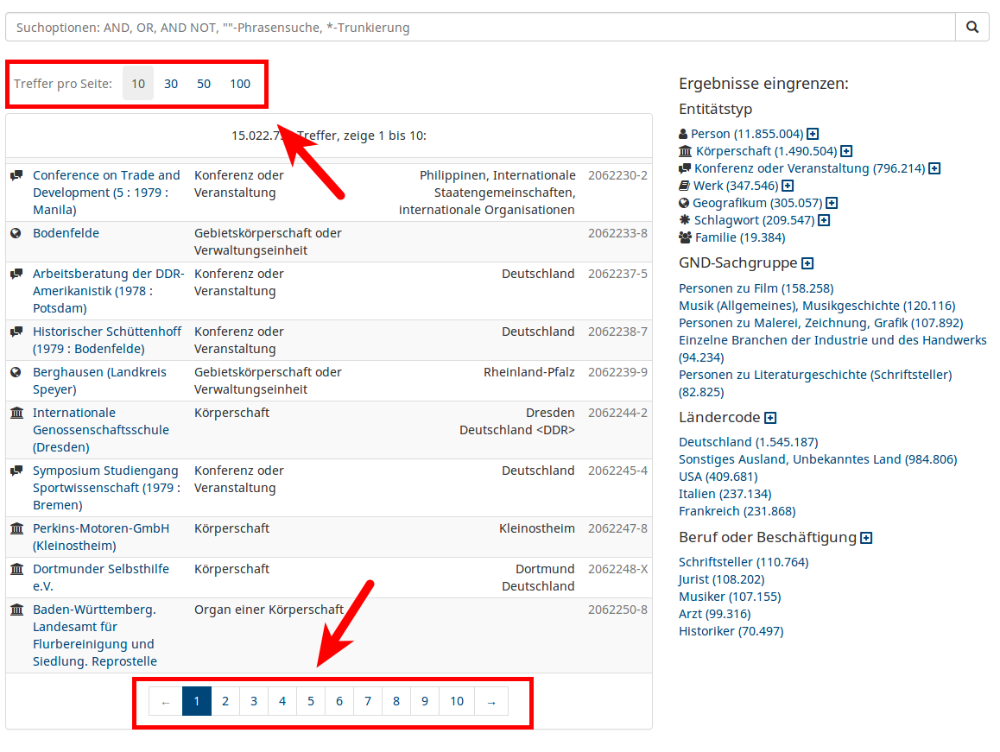
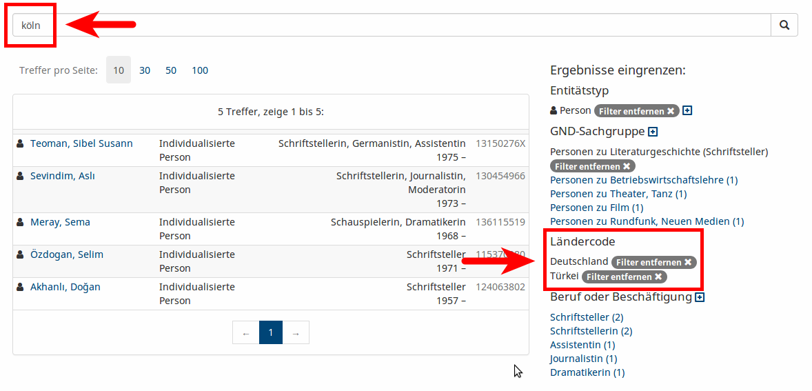
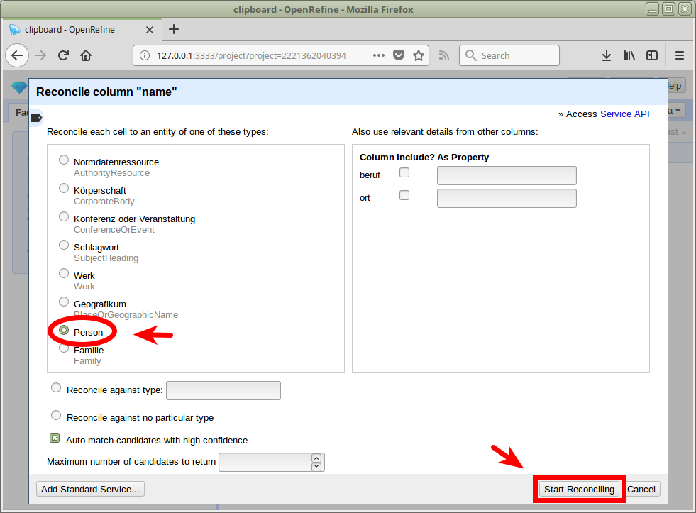
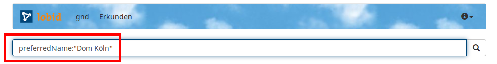
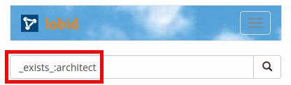

Fabian Steeg, Adrian Pohl & Pascal Christoph

Zusammenfassung

Mit lobid-gnd bietet das Hochschulbibliothekszentrum des Landes Nordrhein-Westfalen (hbz) eine Schnittstelle zur Gemeinsamen Normdatei (GND) für Mensch und Maschine an. In diesem Beitrag werden detailliert die Nutzungsmöglichkeiten von lobid-gnd beleuchtet. Neben einer Vorstellung der graphischen Nutzeroberfläche und der Möglichkeiten komplexer Abfragen gegen die Web-API wird auch der Prozess der Datengenerierung auf Basis des Linked-Data-Angebots der Deutschen Nationalbibliothek (DNB) beschrieben.

Schlüsselwörter

GND, Gemeinsame Normdatei, WebAPIs, JSON-LD, lobid, Linked Open Data

**lobid-gnd – Eine Schnittstelle zur Gemeinsamen Normdatei für Mensch und Maschine**

Mit lobid-gnd bietet das Hochschulbibliothekszentrum des Landes Nordrhein-Westfalen (hbz) eine Schnittstelle zur Gemeinsamen Normdatei (GND) für Mensch und Maschine an. Über [https://lobid.org/gnd](https://lobid.org/gnd) gibt es Zugriff auf alle GND-Entitäten. lobid-gnd ist einer von drei lobid-Diensten. Für historische und technische Hintergründe zu lobid im allgemeinen siehe Steeg et al. (2018). Da es sich bei lobid-gnd um den Dienst handelt, der die meisten Menschen interessieren dürfte und zum anderen um den lobid-Dienst, der als letztes in Version 2 gestartet wurde, werden in diesem Beitrag anhand dieses Beispiels detailliert die Nutzungsmöglichkeiten von lobid beleuchtet. Zu diesem Zweck wird eine konkrete, detaillierte Beschreibung der Datengenerierung, Oberfläche und Web-API von lobid-gnd präsentiert.

## Suche und Navigation in der Benutzeroberfläche

Auf der [Startseite](https://lobid.org/gnd) von lobid-gnd findet sich neben einer kurzen Beschreibung des Dienstes ein Suchschlitz. Außerdem wird – wie auch in [lobid-organisations](https://lobid.org/organisations) – mit jedem Laden der Seite ein zufälliges Bild zu einer GND-Ressource angezeigt. Momentan gibt es [knapp 200.000 Einträge mit Bild](http://lobid.org/gnd/search?q=_exists_%3Adepiction), davon sind die meisten Personen. Wer also Lust hat, die GND ein wenig näher kennenzulernen, kann ja mal die Startseite ein paar Mal neu laden.

Die einfache Suchoberfläche auf der Startseite unterstützt unter anderem Boolesche Operatoren, Phrasensuche und Trunkierung:


Nach der Eingabe im Suchfeld kann einer der Vorschläge direkt ausgewählt werden, um zur Detailansicht zu gelangen:


Über die Enter-Taste oder das Lupen-Icon kann eine Suche angestoßen werden:


Als alternativer Einstieg kann die gesamte GND erkundet werden:


Über beide Wege kommt man zur Trefferliste. Über den Treffern auf der linken Seite kann die Anzahl der Treffer pro Seite gewählt werden, darunter kann zwischen den Seiten gewechselt werden:



Auf der rechten Seite ermöglicht eine facettierte Suche nach *Entitätstyp*, *GND-Sachgruppe*, *Ländercode* und *Beruf oder Beschäftigung* eine Eingrenzung der Ergebnisse:


Als Standard werden in jeder Facette die fünf häufigsten Einträge angezeigt, weitere Einträge lassen sich ein- und ausblenden:


Entitätstypen sind in Untertypen differenziert:


Über die Auswahl unterschiedlicher Facetten lässt sich die Treffermenge präzise eingrenzen, z. B. zur Anzeige [aller hydrologischen Geografika in Nordrhein-Westfalen](http://lobid.org/gnd/search?filter=%2B(type%3ANaturalGeographicUnit)+%2B(gndSubjectCategory.id%3A%22http%3A%2F%2Fd-nb.info%2Fstandards%2Fvocab%2Fgnd%2Fgnd-sc%2319.3%22)+%2B(geographicAreaCode.id%3A%22http%3A%2F%2Fd-nb.info%2Fstandards%2Fvocab%2Fgnd%2Fgeographic-area-code%23XA-DE-NW%22)):


Erweiterte Suchmöglichkeiten ergeben sich aus einer Kombination von Sucheinstieg über das Suchfeld und facettierter Suche sowie über Mehrfachauswahl innerhalb einer Facette:



Der Klick auf einen Suchtreffer führt zu einer Detailansicht. Die Detailseiten enthalten Links zu verknüpften GND-Einträgen. Über die Lupen-Icons kann eine Suche nach Einträgen mit der gleichen Beziehung angestoßen werden, z. B. [alle Teile der Nordsee](https://lobid.org/gnd/search?q=broaderTermPartitive.id%3A%22http%3A%2F%2Fd-nb.info%2Fgnd%2F4042579-4%22&size=50&format=html):


Die visuelle Darstellung im Tab "Beziehungen" erlaubt ebenso eine Navigation zu den verknüpften Entitäten per Klick auf einen Knoten des Graphs und eine Suche nach weiteren Einträgen mit der gleichen Beziehung per Klick auf eine Kante:


Das Piktogramm  verweist auf die dem Eintrag zugrundeliegenden strukturierten Daten im Format JSON-LD. Im folgenden wird die Herkunft, Aktualität und Struktur dieser Daten erläutert, um daran anschließend vorzustellen, wie komplexere Suchanfragen formuliert werden können.

## Datengenerierung und Anreicherung

lobid-gnd ist – neben seiner Funktion als Endnutzerschnittstelle – auch eine Maschinenschnittstelle zur GND. Die Endnutzerschnittstelle basiert auf HTML für die Ansicht im Browser, aber ebenso liefern alle HTTP-GET-Anfragen auf Wunsch JSON(-LD) für die maschinelle Verarbeitung etwa zur Anwendungsentwicklung. Bevor wir aber näher auf die Web-API (_Application Programming Interface_, deutsch: Entwicklungsschnittstelle) eingehen, möchten wir zunächst beschreiben, wie und in welcher Form die GND-Daten indexiert werden.

Die Datenquelle sind die RDF-Daten der GND, die von der Deutschen Nationalbliothek (DNB) [bereitgestellt](http://www.dnb.de/DE/Service/DigitaleDienste/LinkedData/linkeddata_node.html) werden. Das hbz hat Zugriff auf eine OAI-PMH-Schnittstelle der DNB, über die täglich Updates der Daten geholt werden. Diese Daten werden dann für lobid-gnd mit einigen Anpassungen nach JSON-LD konvertiert. Zum Teil waren diese Anpassungen durch Inkonsistenzen in den Ausgangsdaten bedingt, was wir zum Anlass genommen haben, Verbesserungen vorzuschlagen, die zum Teil bereits durch die DNB umgesetzt wurden.

### Der JSON-LD-Kontext

Die meiste Arbeit zur Optimierung der Datenstruktur übernimmt der JSON-LD-Kontext unter [https://lobid.org/gnd/context.jsonld](https://lobid.org/gnd/context.jsonld). Er bewirkt unter anderem folgende Dinge:

- Der Kontext bestimmt, welche JSON-Keys auf welche RDF-Properties gemappt werden, so dass im JSON nicht lange URIs als Keys angezeigt werden.
- Mit Einträgen wie `"AuthorityResource": "http://d-nb.info/standards/elementset/gnd#AuthorityResource"` werden Typen (`type`) im JSON nicht als umständliche URI, sondern als einfacher String angezeigt, so dass die Daten auch leicht verständlich sind für Entwickler*innen, die bisher nicht viel mit Linked Data gearbeitet haben.
- Mittels `"@container": "@set"` wird festgelegt, dass bis auf wenige Ausnahmen alle Properties ein Array als Wert haben, auch wenn es in einem Eintrag nur ein Element als Wert gibt. Dadurch ist die Datenstruktur homogener und vorhersagbarer. Dies spielt etwa für die Indexierung in Elasticsearch eine Rolle, da hier wie bereits gesagt ein bestimmtes Feld immer den gleichen Datentypen (z. B. Array) haben muss. Auch bei der Nutzung der API erleichtert dies die Verarbeitung, da für ein bestimmtes Feld immer von einem identischen Typ ausgegangen werden kann. Im Zusammenspiel mit [entsprechend konfigurierter](https://json-ld.org/spec/latest/json-ld-api/#dom-jsonldoptions-compactarrays) Verarbeitung des JSON-LD ermöglicht dies eine gezielte Konfiguration einzelner Felder.

### Framing

Wir nutzen einen einfachen JSON-LD Frame (Longley et al. 2018), um das JSON in eine hierarchische JSON-Struktur mit einem Wurzelelement zu bringen. Dieser Frame verwendet den gleichen Kontext wie die eigentlichen Einträge, definiert als Typ die Oberklasse aller Einträge und bestimmt, dass der Inhalt immer eingebettet werden soll:

```
{
  "@context": "http://lobid.org/gnd/context.jsonld",
  "@type": "AuthorityResource",
  "@embed": "@always"
}
```

### Homogenisierung von Typen und Label-Properties

Damit das Framing bei jeder GND-Entität funktioniert, muss allen Entitäten der Typ `AuthorityResource` zugewiesen sein. Hier kommen wir zum Punkt, wo wir die Daten der DNB ergänzen, um bestimmte Funktionalitäten zu ermöglichen. Das von der DNB gelieferte [RDF zum Eintrag von Hannah Arendt](https://d-nb.info/gnd/11850391X/about/lds) enthält zum Beispiel folgende Informationen (in Turtle-Notation):

```
@prefix gndo: <http://d-nb.info/standards/elementset/gnd#> .

<http://d-nb.info/gnd/11850391X> a gndo:DifferentiatedPerson ;
  gndo:preferredNameForThePerson "Arendt, Hannah" ;
  gndo:variantNameForThePerson "Blücher, Johanna" .
```

Wie man sieht, wird hier nur die spezifische Klasse (`gndo:DifferentiatedPerson`) angegeben und es werden typspezifische Properties (`gndo:preferredNameForThePerson`, `gndo:variantNameForThePerson`) zur Angabe der Ansetzungs- und Verweisungsformen verwendet. Dies mag für eine Abfrage der Daten über einen SPARQL-Endpoint ausreichend sein, weil die GND-Ontologie (Haffner 2018) Informationen zu  Überklassen und -Properties enthält und somit mit Unterstützung von Reasoning auch entsprechende Abfragen funktionieren. Für eine einheitliche Abfrage der Ansetzungsformen aller GND-Entitäten in einem Suchmaschinenindex und der damit einhergehenden einfachen Bereitstellung von Filtermöglichkeiten nach Oberklassen (Person, Schlagwort, Körperschaft, Geografikum etc.) über eine Web-API reicht das aber nicht aus. Statt etwa einer Suche über alle Daten im Feld `preferredName` müsste eine komplexe Suche nach `preferredNameForThePerson` und aller anderen spezifischen Properties formuliert werden.

Deshalb verzichten wir zum einen auf die Nutzung der spezifischen Namen-Properties und ergänzen zum anderen die Überklassen im JSON-LD. So sehen etwa entsprechenden Teile im JSON-LD zu Hannah Arendt in lobid-gnd so aus:

```json
{
  "@context": "http://lobid.org/gnd/context.jsonld",
  "id":"http://d-nb.info/gnd/11850391X",
  "type":[
    "DifferentiatedPerson",
    "AuthorityResource",
    "Person"
  ],
  "preferredName":"Arendt, Hannah",
  "variantName":[
    "Blücher, Johanna"
  ]
}
```

### Labels für verlinkte Ressourcen

Im JSON-LD wird zu jeder in Beziehung gesetzten GND-Ressource sowie zu den GND-Sachgruppen und Ländercodes die entsprechende Ansetzungsform (wie in den anderen lobid-Diensten) als `label` mitgeliefert. Beim Eintrag zu Hannah Arendt gibt es unter anderen einen Link auf den Sterbeort, auf verschiedene Berufe/Beschäftigungen, auf drei GND-Sachgruppen und auf verwandte Personen. Wo im RDF der GND nur URIs zu finden sind, sieht es in lobid-gnd wie folgt aus:

```json
{
  "@context": "http://lobid.org/gnd/context.jsonld",
  "id":"http://d-nb.info/gnd/11850391X",
  "placeOfDeath":[{
    "id":"http://d-nb.info/gnd/4042011-5",
    "label":"New York, NY"
  }],
  "familialRelationship":[{
    "id":"http://d-nb.info/gnd/119378418",
    "label":"Blücher, Heinrich"
  },{
    "id":"http://d-nb.info/gnd/118502751",
    "label":"Anders, Günther"
  }],
  "gndSubjectCategory":[{
    "id":"http://d-nb.info/standards/vocab/gnd/gnd-sc#4.7p",
    "label":"Personen zu Philosophie"
  }],
  "geographicAreaCode":[{
    "id":"http://d-nb.info/standards/vocab/gnd/geographic-area-code#XA-DE",
    "label":"Deutschland"
  }]
}
```

Dies ermöglicht es API-Nutzer*innen auf einfache Weise, menschenlesbare Labels anstatt bloße URIs in Anwendungsoberflächen anzuzeigen. Es macht zudem die Suche nach Einträgen mit diesen Labels (z. B. _Schriftsteller_) überhaupt erst möglich, wie auch Performance-kritische Anwendungsfälle, bei denen zusätzliche Lookups zur Ermittlung der Labels nicht praktikabel wären. So verwendet etwa die oben beschriebene Vorschlagsfunktion im Suchfeld die Labels zum schnellen Auffinden des gesuchten Eintrags.

### Anreicherung mit Links und Bildern aus EntityFacts

Neben dem GND-RDF stellt die DNB mit [EntityFacts](http://www.dnb.de/DE/Service/DigitaleDienste/EntityFacts/entityfacts_node.html) einen Dienst bereit, der einfaches JSON-LD zu Personen, Körperschaften und Geographika aus der GND anbietet, angereichert um Links zu anderen Datenanbietern (Wikidata, ORCID, BnF etc.) sowie zu Abbildungen einer GND-Entität auf Wikimedia Commons. Die Bereitstellung zur freien Wiederverwendung eines Dumps der EntityFacts-Daten seitens der DNB hat uns dazu ermutigt, diese zusätzlichen Informationen in lobid-gnd zu ergänzen. Im Beispiel Hannah Arendt sind dies unter anderem folgende Informationen:

```json
{
  "id":"http://d-nb.info/gnd/11850391X",
  "depiction":[{
    "id":"https://commons.wikimedia.org/wiki/Special:FilePath/Hannah_arendt-150x150.jpg",
    "url":"https://commons.wikimedia.org/wiki/File:Hannah_arendt-150x150.jpg?uselang=de",
    "thumbnail":"https://commons.wikimedia.org/wiki/Special:FilePath/Hannah_arendt-150x150.jpg?width=270"
  }],
  "sameAs":[{
    "collection":{
      "abbr":"BNF",
      "name":"Bibliothèque nationale de France",
      "publisher":"Bibliothèque nationale de France",
      "icon":"http://www.bnf.fr/bnf_dev/icono/favicon.ico",
      "id":"http://www.wikidata.org/entity/Q19938912"
    },
    "id":"http://catalogue.bnf.fr/ark:/12148/cb118890622"
  },{
    "collection":{
      "abbr":"WIKIDATA",
      "name":"Wikidata",
      "publisher":"Wikimedia Foundation Inc.",
      "icon":"https://www.wikidata.org/static/favicon/wikidata.ico",
      "id":"http://www.wikidata.org/entity/Q2013"
    },
    "id":"http://www.wikidata.org/entity/Q60025"
  }]
}
```

Mit diesen Anreicherungen kann auf der Basis von Identifikatoren Dritter in lobid-gnd gesucht werden, etwa anhand einer [ORCID](http://lobid.org/gnd/search?q=%220000-0002-7613-4123%22) oder eines [ISNI](http://lobid.org/gnd/search?q=%220000000114476112%22). Mit den Bildern können Einträge wie z. B. Autorenseiten illustriert werden. Es ist zu beachten, dass die Attributions- und Lizenzinformationen zu den Bildern nicht mitgeliefert werden, sondern von der Wikimedia Commons API geladen werden müssen. (Zur Umsetzung dessen siehe z. B. [diesen Kommentar](https://github.com/hbz/lobid-organisations/issues/321#issuecomment-285366696) und als Beispiel unsere [aktuelle Implementierung](https://github.com/hbz/lobid-gnd/blob/580365da19ae5b3264376289480d836adc8894c4/app/controllers/HomeController.java#L355).)

## Web-API

Das im vorherigen Abschnitt beschriebene JSON-LD indexieren wir in einen Elasticsearch-Suchmaschinenindex und bieten die Elasticsearch-Abfragesprache für Suchanfragen und zum Filtern an. Somit sind direkt nützliche Funktionen für interessierte Nutzer verfügbar wie z. B. Unterstützung der [Lucene Query Language](https://lucene.apache.org/core/2_9_4/queryparsersyntax.html) und `_exists_`-Abfragen. Eine Dokumentation der Elasticsearch `query_string` DSL findet sich [hier](https://www.elastic.co/guide/en/elasticsearch/reference/5.6/query-dsl-query-string-query.html). Darauf aufsetzend bieten wir auch einen [Parameter für Auto-Suggest](http://lobid.org/gnd/api#auto-complete), dessen Rückgabefelder bei Bedarf angepasst werden können. Für eine detaillierte API-Beschreibung verweisen wir auf die Dokumentation unter [https://lobid.org/gnd/api](https://lobid.org/gnd/api).

### Bulk Downloads

Für jede lobid-gnd-Abfrage kann – wie auch in lobid-resources – die gesamte Ergebnismenge als [JSON Lines](http://jsonlines.org/) heruntergeladen werden, indem der Query-Parameter `format=jsonl` in der HTTP-Anfrage ergänzt wird. Im Antwortformat wird dann pro Zeile ein GND-Eintrag zurückgeliefert, zum Beispiel alle GND-Entitäten vom Typ "Sammlung" (Unterklasse von "Werk"):

[http://lobid.org/gnd/search?filter=type:Collection&format=jsonl](http://lobid.org/gnd/search?filter=type:Collection&format=jsonl)

Bei solchen kleineren Ergebnismengen reicht der JSON-Lines-Download aus, werden größere Untermengen der GND abgefragt, empfiehlt es sich, das Ergebnis komprimiert als gzip herunterzuladen. Dafür muss der HTTP-Anfrage der entsprechende Accept-Header mitgegeben werden, z. B. mit curl:

`$ curl --header "Accept-Encoding: gzip" 'http://lobid.org/gnd/search?filter=type:Collection&format=jsonl'`

### OpenRefine Reconciliation API

Mit der OpenRefine Reconciliation API ist es auf einfache Weise möglich, mit dem für Datenaufbereitung und -anreicherung beliebten Werkzeug [OpenRefine](http://openrefine.org/) eine Liste, etwa von Ansetzungsformen, mit der GND abzugleichen, um die Textstrings auf GND-IDs zu matchen und mit Details der GND-Einträge anzureichern. Dafür müssen die abzugleichenden Daten in OpenRefine geladen werden, die entsprechende Spalte ausgewählt und der Reconciliation-Prozess z. B. wie folgt durchgeführt werden:

1.Start des Reconciliation-Prozesses für eine Spalte in OpenRefine

2. Ergänzen des lobid-gnd Reconciliation Endpoints (`https://lobid.org/gnd/reconcile`) in OpenRefine

3. (Optionale) Auswahl einer GND-Untermenge (hier "Person") für Reconciliation

4. Start der API-Abfrage mit Klick auf "Start Reconciling"

Eine detaillierte Anleitung zur [Verwendung der GND Reconciliation in OpenRefine](http://blog.lobid.org/2018/08/27/openrefine.html) findet sich in unserem Blog.

## Formulierung komplexer Suchanfragen

Oben haben wir bereits die Oberfläche von lobid-gnd und ihre Funktionen wie z. B. einfache Suchen beschrieben. Die API ermöglicht aber auch komplexere Abfragen, für die ein wenig Vertrautheit mit den zugrundeliegenden Datenstrukturen nötig ist. Dies soll nun an einigen Beispielen ausgeführt werden.

### Query-Grundlagen

Bevor wir die Suchmöglichkeiten an einigen Beispielen illustrieren, werden zunächst einige generelle Informationen zur Suche geliefert.

Alle Abfragen können wie oben beschrieben über das Suchfeld auf der lobid-gnd-Seite eingegeben werden:


Die Queries können auch direkt als Teil der URL angegeben und im Browser geöffnet werden:

[http://lobid.org/gnd/search?q=Dom+Köln](http://lobid.org/gnd/search?q=Dom+K%C3%B6ln)

Oder auf der Kommandozeile via curl:

<small>`$ curl "http://lobid.org/gnd/search?q=Dom+K%C3%B6ln"`</small>

### Default-Sucheinstellungen & boolesche Operatoren

Standardmäßig geht eine im Suchfenster angestoßene Suche über alle Felder. Mehrere Suchterme werden dabei per Default mit einem booleschen `AND` verknüpft (bei den anderen lobid-Diensten ist derzeit eine OR-Verknüpfung Standard). Boolesche Operatoren lassen sich aber auch passgenau für den jeweiligen Zweck angeben. Beispiele:

- <a href="http://lobid.org/gnd/search?q=Dom+AND+(Aachen OR Köln)">Dom UND (Aachen ODER Köln)</a>
- [Geographika in (Äthiopien ODER Eritrea)](http://lobid.org/gnd/search?q=type%3APlaceOrGeographicName+AND+geographicAreaCode.id%3A%28%22http%3A%2F%2Fd-nb.info%2Fstandards%2Fvocab%2Fgnd%2Fgeographic-area-code%23XC-ET%22+OR+%22http%3A%2F%2Fd-nb.info%2Fstandards%2Fvocab%2Fgnd%2Fgeographic-area-code%23XC-ER%22%29)

### Anzeige der JSON-Daten

In den folgenden Beispielen wird immer wieder auf die strukturierten Daten im Format JSON-LD Bezug genommen, die es für jeden Eintrag in lobid-gnd gibt. Anzeigen lassen sich diese wie folgt:

1. Mit Klick auf das JSON-LD-Zeichen in einer Detailansicht:
[](http://lobid.org/gnd/11850391X)
2. Durch Anhängen von `.json` an die URL eines Einzeltreffers, z. B. [http://lobid.org/gnd/11850391X.json](http://lobid.org/gnd/11850391X.json)
3. Der Vollständigkeit halber: **Bei Suchanfragen** muss der Parameter `format=json` angehängt werden, um die gesamte Ergebnisliste als JSON-LD anzuzeigen, z. B. [http://lobid.org/gnd/search?q=hannah+arendt&format=json](http://lobid.org/gnd/search?q=hannah+arendt&format=json). Alternativ können auch mit dem Parameter `format=jsonl` JSON Lines ausgegeben werden, d.h. pro Zeile ein Eintrag als JSON, z. B. [http://lobid.org/gnd/search?q=hannah+arendt&format=jsonl](http://lobid.org/gnd/search?q=hannah+arendt&format=jsonl).

Die Bedeutung eines Feldes lässt sich im [JSON-LD-Kontext](https://json-ld.org/spec/latest/json-ld/#the-context) unter [http://lobid.org/gnd/context.jsonld](http://lobid.org/gnd/context.jsonld) nachschlagen. Um beispielsweise zu verstehen, wie das Feld `broaderTermPartitive` verwendet wird, kann im JSON-LD-Kontext nach diesem Feld gesucht werden. Dem dort angegebenen Link zur Beschreibung der zugrundeliegenden RDF-Property folgend gelangen wir zur Beschreibung von ["Oberbegriff partitiv"](http://d-nb.info/standards/elementset/gnd#broaderTermPartitive) in der GND-Ontologie.

### Feldsuchen

Über die `<Feld>:<Suchbegriff>`-Syntax kann in spezifischen Feldern gesucht werden, z. B. nach einer bestimmten Ansetzungsform:



[http://lobid.org/gnd/search?q=preferredName:"Dom+Köln"](http://lobid.org/gnd/search?q=preferredName:"Dom+K%C3%B6ln")

Soll ein Feld abgefragt werden, das sich nicht auf der obersten Ebene der geschachtelten JSON-Daten befindet, muss der Pfad identifiziert werden, das heißt die Felder, in denen das Feld eingebettet ist, müssen angegeben werden. Beispielsweise `professionOrOccupation.label` in folgenden Daten:

```json
{
  "professionOrOccupation": [{
    "id": "http://d-nb.info/gnd/4124099-6",
    "label": "Sänger"
  }]
}
```

So kann etwa nach [`professionOrOccupation.label:Sänger*`](http://lobid.org/gnd/search?q=professionOrOccupation.label:Sänger*) gesucht werden, wenn sowohl männliche wie auch weibliche Vokalist\*innen gefunden werden sollen.

### Beispiele

#### exists-Abfragen

Häufig ist es hilfreich herauszufinden, wie viele und welche Einträge überhaupt ein bestimmtes Feld beinhalten bzw. in wie vielen Einträgen ein bestimmtes Feld fehlt. Dafür kann eine Anfrage in der Form `_exists_:<Feldname>` verwendet werden, optional mit dem booleschen `NOT`, um alle Einträge zu bekommen, die das jeweilige Feld *nicht* haben, z. B. "geschlechtslose Geister":

[`http://lobid.org/gnd/search?q=type:Spirits+AND+NOT+_exists_:gender`](http://lobid.org/gnd/search?q=type%3ASpirits+AND+NOT+_exists_%3Agender)

#### Einträge mit Angabe eines Architekten

Beim Betrachten etwa des Eintrags zum [Friedenspark Köln](http://lobid.org/gnd/1065252633) fällt auf, dass ein Architekt angegeben ist. Bei Interesse daran, welche weiteren Einträge Architekt\*innen angeben, lässt sich das wie folgt herausfinden.

Zunächst wird im JSON nachgeschaut, wie das entsprechende Feld heißt:

```json
{
  "id":"http://d-nb.info/gnd/1065252633",
  "architect":[{
    "id":"http://d-nb.info/gnd/118530232",
    "label":"Encke, Fritz"
  }]
}
```

Dann kann die entsprechende `_exists`-[Anfrage](http://lobid.org/gnd/search?q=_exists_:architect) formuliert werden:



Unterfelder werden wie beschrieben über die Punkt-Notation angegeben, z. B. Architekten mit "Fritz" im Namen:
[`architect.label:Fritz`](http://lobid.org/gnd/search?q=architect.label:Fritz)

#### Gleichzeitige Suche in Ansetzungs- und Verweisungsformen

Dieses Beispiel stammt aus einer E-Mail-Anfrage an das lobid-Team:

> Noch eine Frage habe ich zur API. Kann ich die Suche nach Namen so einschränken, dass ich nach exakten Matches in den `variantName` oder `preferredName` suchen kann?

Das geht über eine Kombination von booleschem OR und Phrasensuche mit `"<Phrase>"` in den entsprechenden Feldern:

[`preferredName:"Muka, Arnošt" OR variantName:"Muka, Arnošt"`](http://lobid.org/gnd/search?q=preferredName%3A%22Muka%2C+Arno%C5%A1t%22+OR+variantName%3A%22Muka%2C+Arno%C5%A1t%22)


#### Suche nach Einträgen mit Wikidata-Link aber ohne Bild

Im Kontext der Anzeige eines zufälligen Bildes auf der [lobid-gnd-Startseite](https://lobid.org/gnd) kam die Frage auf, wie viele und welche Einträge einen Wikidata-Link aber kein Bild haben. Dafür müssen zunächst die Daten eines Eintrags angeschaut werden, der beides hat, z. B. [Hannah Arendt](http://lobid.org/gnd/11850391X.json). Hier die für uns wichtigen Ausschnitte:

```json
{
  "id":"http://d-nb.info/gnd/11850391X",
  "depiction":[{
    "id":"https://commons.wikimedia.org/wiki/Special:FilePath/Hannah_arendt-150x150.jpg",
    "url":"https://commons.wikimedia.org/wiki/File:Hannah_arendt-150x150.jpg?uselang=de",
    "thumbnail":"https://commons.wikimedia.org/wiki/Special:FilePath/Hannah_arendt-150x150.jpg?width=270"
  }],
  "sameAs":[{
    "collection":{
      "abbr":"WIKIDATA",
      "name":"Wikidata",
      "publisher":"Wikimedia Foundation Inc.",
      "icon":"https://www.wikidata.org/static/favicon/wikidata.ico",
      "id":"http://www.wikidata.org/entity/Q2013"
    },
    "id":"http://www.wikidata.org/entity/Q60025"
  }]
}
```

Die Verlinkung zu Wikidata findet sich innerhalb eines Objekts im `sameAs`-Array. Gekennzeichnet als Wikidata-Verlinkung ist sie durch die angegebene Sammlung (`collection`). Soll also eine Suche auf Einträge eingeschränkt werden, die einen Link zu Wikidata haben, muss nach Einträgen mit der ID `http://www.wikidata.org/entity/Q2013` im Feld `sameAs.collection.id` gesucht werden:

[`sameAs.collection.id:"http://www.wikidata.org/entity/Q2013"`](http://lobid.org/gnd/search?q=sameAs.collection.id:%22http://www.wikidata.org/entity/Q2013%22)

Hinweis: Damit die Suche funktioniert muss die Wikidata-URI (`http://www.wikidata.org/entity/Q2013`) in Anführungszeichen gesetzt werden (exakte Phrasensuche).

Wir wollen aber nicht alle Einträge mit Wikidata-Link, sondern nur jene *ohne Bild*. Das heißt wir müssen die Bedingung ergänzen, dass das Feld `depiction` nicht vorhanden ist. Hier kommt uns die oben eingeführte `_exist_`-Anfrage zur Hilfe. Konkret müssen wir zur Suchanfrage `AND NOT _exists_:depiction` ergänzen, so dass am Ende dabei rauskommt:

[`sameAs.collection.id:"http://www.wikidata.org/entity/Q2013" AND NOT _exists_:depiction`](http://lobid.org/gnd/search?q=sameAs.collection.id:"http://www.wikidata.org/entity/Q2013"+AND+NOT+_exists_:depiction)

#### Personen, die während der NS-Zeit in Köln geboren wurden

Um eine Frage wie z. B. "Welche in der GND verzeichneten Personen wurden während der NS-Zeit in Köln geboren?" zu beantworten, ist es sinnvoll, sich einen Eintrag zu suchen, der die nötigen Informationen zur Beantwortung einer solchen Frage besitzt. Hier z. B. die strukturierten Daten zum Eintrag von [Konrad Adenauer](http://lobid.org/gnd/11850066X.json), der folgende Informationen zu Geburtsort und -datum enthält:

```json
{
  "id":"http://d-nb.info/gnd/11850066X",
  "placeOfBirth":[{
    "id":"http://d-nb.info/gnd/4031483-2",
    "label":"Köln"
  }],
  "dateOfBirth":[
    "1876-01-05"
  ]
}
```

Den ersten Schritt – die Eingrenzung auf in Köln geborene Personen – können wir auf einfache Weise über die Benutzeroberfläche für den Eintrag von [Konrad Adenauer](http://lobid.org/gnd/11850066X) vollziehen: Mit einem Klick auf die Lupe neben "Geburtsort Köln" wird eine Abfrage nach allen in Köln geborenen Menschen in der GND gestartet.


Jetzt müssen wir die vorhandene Abfrage ([`placeOfBirth.id:"http://d-nb.info/gnd/4031483-2"`](http://lobid.org/gnd/search?q=placeOfBirth.id%3A%22http%3A%2F%2Fd-nb.info%2Fgnd%2F4031483-2%22&format=html)) noch um eine Einschränkung des Geburtsdatums ergänzen. Hier können wir eine [range query](https://www.elastic.co/guide/en/elasticsearch/reference/5.6/query-dsl-query-string-query.html#_ranges) verwenden, die Zeitrahmen mit verschiedenen Detailgraden (Jahr, Monat, Tag etc.) ermöglicht. Für unseren Fall probieren wir zunächst die tagesgenaue Eingrenzung mit `dateOfBirth:[1933-01-30 TO 1945-05-08]`:

[`placeOfBirth.id:"http://d-nb.info/gnd/4031483-2" AND dateOfBirth:[1933-01-30 TO 1945-05-08]`](http://lobid.org/gnd/search?q=placeOfBirth.id%3A%22http%3A%2F%2Fd-nb.info%2Fgnd%2F4031483-2%22+AND+dateOfBirth%3A%5B1933-01-30+TO+1945-05-08%5D)

Ebenfalls möglich ist eine jahresgenaue Abfrage (enthält hier auch Geburtsdaten im Jahr 1933 vor dem 30.1. und im Jahr 1945 nach dem 8.5.):

[`placeOfBirth.id:"http://d-nb.info/gnd/4031483-2" AND dateOfBirth:[1933 TO 1945]`](http://lobid.org/gnd/search?q=placeOfBirth.id%3A%22http%3A%2F%2Fd-nb.info%2Fgnd%2F4031483-2%22+AND+dateOfBirth%3A%5B1933+TO+1945%5D)

Je nach Zweck kann die eine oder andere Abfrage sinnvoller sein.

#### Vollständige Query-Syntax

lobid-gnd ist wie gesagt auf Basis von Elasticsearch umgesetzt. Wir verweisen hier nochmals auf die vollständige Dokumentation der [Elasticsearch Query String Syntax](https://www.elastic.co/guide/en/elasticsearch/reference/5.6/query-dsl-query-string-query.html#query-string-syntax) sowie der [Apache Lucene Query Syntax](https://lucene.apache.org/core/2_9_4/queryparsersyntax.html) (Elasticsearch basiert auf [Apache Lucene](https://de.wikipedia.org/wiki/Apache_Lucene)).

# Referenzen

Haffner, Alexander (2018): *GND Ontology* [online]. Zugriff am 2018-09-12. Verfügbar unter: [http://d-nb.info/standards/elementset/gnd](http://d-nb.info/standards/elementset/gnd)

Steeg, Fabian / Pohl, Adrian / Christoph, Pascal (2018): lobid – Dateninfrastruktur für Bibliotheken. In Informationspraxis 4 (2). Verfügbar unter {doi-link einfügen}.

**Autoren**

Fabian Steeg, Hochschulbibliothekszentrum des Landes NRW, Jülicher Str.6, D-50674 Köln
[http://lobid.org/team/fs](http://lobid.org/team/fs)
steeg@hbz-nrw.de

Adrian Pohl, Hochschulbibliothekszentrum des Landes NRW, Jülicher Str.6, D-50674 Köln
[http://lobid.org/team/ap](http://lobid.org/team/ap)
pohl@hbz-nrw.de

Pascal Christoph, Hochschulbibliothekszentrum des Landes NRW, Jülicher Str.6, D-50674 Köln
[http://lobid.org/team/pc](http://lobid.org/team/pc)
christoph@hbz-nrw.de