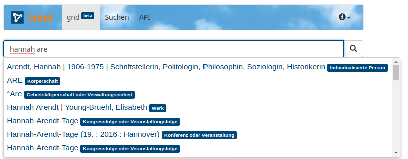
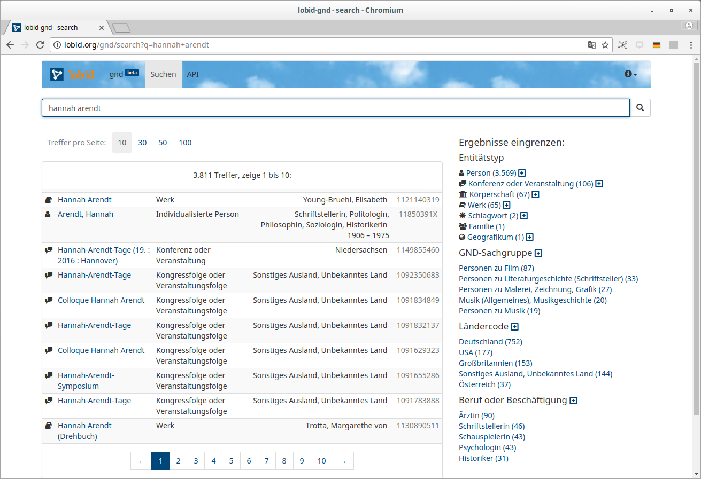
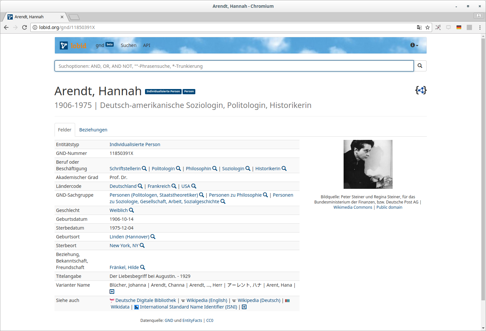
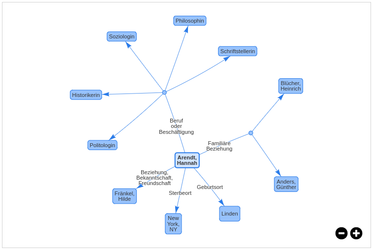

# Lobid – Dateninfrastruktur für Bibliotheken

<!-- START doctoc generated TOC please keep comment here to allow auto update -->
<!-- DON'T EDIT THIS SECTION, INSTEAD RE-RUN doctoc TO UPDATE -->


- [Überblick](#%C3%BCberblick)
    - [lobid: Oberflächen und APIs](#lobid-oberfl%C3%A4chen-und-apis)
    - [Warum APIs?](#warum-apis)
    - [Architektur: von horizontalen Schichten zu vertikalen Schnitten](#architektur-von-horizontalen-schichten-zu-vertikalen-schnitten)
    - [JSON-LD: eine RDF-Serialisierung oder JSON mit Kontext](#json-ld-eine-rdf-serialisierung-oder-json-mit-kontext)
    - [Benutzerschnittstellen](#benutzerschnittstellen)
- [Entwicklungsprozess](#entwicklungsprozess)
    - [Open Source](#open-source)
    - [Visualisierung](#visualisierung)
    - [Reviews](#reviews)
- [Vokabulare](#vokabulare)
    - [Ein gewachsenens Applikationsprofil](#ein-gewachsenens-applikationsprofil)
    - [RDF: Properties und Klassen suchen und auswählen](#rdf-properties-und-klassen-suchen-und-ausw%C3%A4hlen)
    - [Beispiele](#beispiele)
    - [Ergebnis](#ergebnis)
- [Dokumentation](#dokumentation)
    - [Die API](#die-api)
    - [Was dokumentieren?](#was-dokumentieren)
    - [Wie dokumentieren?](#wie-dokumentieren)
- [Fallstudie: lobid-gnd](#fallstudie-lobid-gnd)
    - [Eine Schnittstelle zur GND für Mensch und Maschine](#eine-schnittstelle-zur-gnd-f%C3%BCr-mensch-und-maschine)
    - [Suche und Navigation](#suche-und-navigation)
    - [Formulierung komplexer Suchanfragen](#formulierung-komplexer-suchanfragen)
    - [Bulk Downloads, OpenRefine-API und mehr](#bulk-downloads-openrefine-api-und-mehr)

<!-- END doctoc generated TOC please keep comment here to allow auto update -->

<!-- START doctoc-->

<!-- END doctoc generated TOC please keep comment here to allow auto update -->

# Überblick

## lobid: Oberflächen und APIs

[lobid](http://lobid.org) stellt Rechercheoberflächen und offene Programmierschnittstellen (APIs) zur Verfügung, die auf Linked Open Data (LOD) basieren. lobid wird vom Hochschulbibliothekszentrum des Landes NRW betrieben. [lobid-resources](http://lobid.org/resources) bietet Zugriff auf den hbz-Verbundkatalog. [lobid-organisations](http://lobid.org/organisations) bietet Informationen zu Gedächtnisinstitutionen im deutschsprachigen Raum. [lobid-gnd](http://lobid.org/gnd) bietet Zugriff auf die Gemeinsame Normdatei (GND).

## Warum APIs?

Die Lobid-API bietet einheitlichen Zugriff auf bibliothekarische Daten über eine Web-basierte Programmierschnittstelle (application programming interface, API). Sie liefert JSON für Linked Data (JSON-LD):


Die Grundidee ist dabei eine Entkopplung von Anwendungen, die diese Daten verwenden, von spezifischen Datenquellen, Formaten und Systemen. So können sich diese Formate und Systeme ändern, ohne dass Änderungen in den Anwendungen nötig werden, die auf die Daten über die API zugreifen. Dies ermöglicht die Entwicklung von herstellerunabhängigen, nachhaltigen Anwendungen auf Basis bibliothekarischer Daten. Siehe auch: [Warum Bibliotheken APIs brauchen](http://fsteeg.com/notes/why-lod-needs-applications-and-libraries-need-apis) (englisch).

## Architektur: von horizontalen Schichten zu vertikalen Schnitten

Die hier beschriebenen lobid-Dienste bilden die zweite Version der im Jahr 2013 veröffentlichten lobid-APIs, die wir auf Basis der Erfahrungen mit diesem ersten System entwickelt haben. Details und Motivation für diese Entwicklung haben wir [auf GitHub dokumentiert](https://github.com/hbz/lobid/issues/1).

Das lobid 1.x-System basierte auf einer klassischen monolithischen Schichtenarchitektur: wir hatten ein Git-Repository, das die Implementierung für das Backend enthielt, mit der Logik aller Datentransformationen und der Indexschicht für alle Daten. Ein weiteres Git-Repository implementierte die APIs und ein gemeinsames Frontend für alle Datensets, die so alle innerhalb eines Prozesses ausgeliefert wurden.

Dies führte insgesamt zu einer Verquickung der verschiedenen Datensets: um etwa auf eine neuere Version unserer Suchmaschine (Elasticsearch) umzustellen, die Features bereistellt, die wir für eines der Datensets brauchten, mussten alle Datensets umgestellt werden, da die Applikation, die ja in einem einzigen Prozess lief, nicht von verschiedenen Elasticsearch-Versionen abhängen kann. Ebenso kam es zu inhaltlich eigentlich unnötigen Anhängigkeitskonflikten zwischen Software-Bibliotheken, die jeweils nur von den APIs unterschiedlicher Datensets benötigt wurden.

Daher haben wir für die 2.0-Version lobid in [vertikale, in sich abgeschlossene Systeme](http://fsteeg.com/notes/more-self-containedness-less-code-sharing) für jedes Datenset (resources, oreganisations, gnd) aufgespalten:


Durch die Kombination dieser Module in der Horizontalen haben wir nach wie vor eine gemeinsame API und eine gemeinsame Oberfläche für alle Dienste, doch Teile dieser API und Oberfläche sind in Module gekapselt, die je ein Datenset behandeln. Diese Module enthalt den für das jeweilige Datenset spezifischen Code und die spezifischen Abhängigkeiten und können unabhängig analysiert, verändert und installiert werden.

## JSON-LD: eine RDF-Serialisierung oder JSON mit Kontext

JSON-LD ist eine W3C-Empfehlung für eine JSON-basierte Linked-Data-Serialisierung. Man kann JSON-LD aus zwei Perspektiven betrachten: einerseits als RDF-Serialisierung (wie N-Triples, Turtle oder RDF/XML), andererseits als eine Möglichkeit, JSON zum Verlinken von Daten zu verwenden. Diese doppelte Perspektive spiegelt sich auch in der [JSON-LD-Spezifikation](https://www.w3.org/TR/json-ld/) wider, die beschreibt dass JSON-LD "als RDF verwendet werden kann", und dass es "direkt als JSON verwendet werden kann, ohne Kenntnis von RDF" (Übersetzung von uns). Reguläres JSON wird durch das [Beifügen eines Kontexts](https://www.w3.org/TR/json-ld/#the-context) als RDF serialisierbar.

### Generisches JSON-LD im lobid 1.x-System

In der ersten Version der lobid-APIs haben wird im Zuge unserer Datentransformation N-Triples erzeugt und diese automatisch mit einem JSON-LD-Prozessor konvertiert. Hier haben wir JSON-LD vollständig als RDF-Serialisierung betrachtet:


Im resultierenden JSON-LD hatten wir so die URIs aus den Triples als JSON-Schlüsselwörter. Diese Daten haben wir als [expandiertes JSON-LD](https://www.w3.org/TR/json-ld/#expanded-document-form) in Elasticsearch indexiert. Elasticsearch erfordert konsistente Daten für ein gegebenes Feld, z.B. muss etwa der Wert von `alternateName` immer ein String sein, oder immer ein Array. Wenn die Werte mal ein String, mal ein Array sind, führ dies bei der Indexierung in Elasticsearch zu einem Fehler. In der kompakten JSON-LD Serialisierung werden einzelne Werte jedoch direkt serialisiert (z.B. als String), wenn jedoch in einem anderen Dokumente für das gleiche Feld mehrere Werte angegeben sind, wird ein Array verwendet. Expandiertes JSON-LD verwendet hingegen immer Arrays. Eine JSON-LD-Form, bei der kompakte Keys (Schlüsselwörter) mit expandierten Werten kombiniert sind gibt es in der Form nicht (siehe [https://github.com/json-ld/json-ld.org/issues/338](https://github.com/json-ld/json-ld.org/issues/338)).

Beim Ausliefern der Daten über die API haben wir die Daten dann in [kompaktes JSON-LD](https://www.w3.org/TR/json-ld/#compacted-document-form) konvertiert, um anstelle der URIs kurze, benutzerfreundliche JSON-Keys zu bekommen. D.h. wir haben im Grunde zwei verschiedene Formate erzeugt und verwendet: das interne Indexformat und das extern sichtbare API-Format.

### Maßgeschneidertes JSON-LD in den neuen Systemen

#### Erstellung von JSON-LD als JSON mit Kontext: lobid-organisations

Bei lobid-organisations, dem ersten Datenset, das wir auf den neuen Ansatz umgezogen haben, haben wir das Vorgehen umgedreht – statt manuell N-Triples anzufertigen, und diese automatisch in JSON-LD zu konvertieren, erzeugen wir das JSON mit genau der Struktur, die wir brauchen. Auf dieser Grundlage generieren wir dann RDF-Serialisierungen wie N-Triples:


Der zentrale Vorteil dieses Ansatzes ist, dass wir unseren konkreten Anwendungsfall nach vorne stellen: wir bauen explizit unsere API, so wie sie für unsere Anwendungen Sinn macht, anstatt zuerst eine Abstraktion zu erzeugen, aus der wir dann konkrete Darstellungen generieren, die von unseren Anwendungen verwendet werden.

Im Vergleich zum Ansatz im ersten lobid-System befinden wir uns hier am anderen Ende des Spektrums der Perspektiven auf JSON-LD, die wir oben beschrieben haben: wir behandeln hier JSON-LD als JSON, ohne bei der Produktion der Daten, oder bei ihrer Verwendung, Kenntisse von RDF zu erfordern.

#### Erstellung von JSON-LD als RDF-Serialisierung: lobid-resources

In der neuen Version von lobid-resources haben wir einen Mittelweg genommen. Wir haben uns entschlossen, auf die bestehende Transformation der Katalogdaten in N-Triples aufzubauen. Wir verwenden dann Code, der von Jan Schnasse im [Etikett-Projekt](https://github.com/hbz/etikett) entwickelt wurde, um maßgeschneidertes JSON-LD aus den N-Triples zu erzeugen. Wie in lobid-organisations (und im Gegensatz zur ersten Version von lobid-resources), ist das maßgeschneiderte JSON-LD zugleich das Index- wie auch das von der API gelieferte Format.

### Vorteile des maßgeschneiderten JSON-LD

Beide Ansätze erzeugen also maßgeschneidertes JSON-LD, sei es auf spezifische Weise aus N-Triples generiert, oder manuell erzeugtes JSON. Dieses maßgeschneiderte JSON-LD hat mehrere Vorteile.

#### Was man sieht ist was man abfragen kann

Ein zentraler Aspekt der neuen Systeme ist, dass wir nun das gleiche Format liefern, das auch im Index gespeichert ist. Dies ermöglicht beliebige Abfragen der Daten über generische Mechanismen, ohne dass wir spezifische Anfragen implementieren müssen. Betrachten wir etwa einen bestimmten Datensatz, z.B. [http://lobid.org/organisations/DE-605?format=json](http://lobid.org/organisations/DE-605?format=json), so sehen wir folgendes:

	"classification" : {
	  "id" : "http://purl.org/lobid/libtype#n96",
	  "type" : "Concept",
	  "label" : {
	    "de" : "Verbundsystem/ -kataloge",
	    "en" : "Union Catalogue"
	  }
	}

Auf Basis der Daten, die wir hier sehen, können wir ein beliebiges Feld nehmen, z.B. `classification.label.en` (die Punkte bilden die Schachtelung der Felder ab) und eine Abfrage wie [http://lobid.org/organisations/search?q=classification.label.en:Union](http://lobid.org/organisations/search?q=classification.label.en:Union) formulieren. Im alten System, bei dem im Index expandiertes JSON-LD gespeichert war, die API aber kompaktes JSON-LD lieferte, brauchten wir spezifische Query-Parameter um Feldsuchen in praxistauglicher Art (ohne URIs als Feldnamen) umzusetzen, etwa für Titel, Autoren oder Schlagwörter, z.B.:

`http://lobid.org/resource?name=Ehrenfeld`

Diese können nun stattdessen über einen generischen `q`-Parameter und die tatsächlichen Feldnamen aus den Daten formuliert werden:

`http://lobid.org/resources/search?q=title:Ehrenfeld`

So vermeiden wir eine Beschränkung auf die von uns antizipierten Arten von Abfragen, und öffnen stattdessen den API-Zugriff auf die kompletten Daten.

#### Semantisch strukturierte Daten

Das generierte JSON-LD des alten Systems war eine flache Struktur mit JSON-Objekten in einem Array unter dem `@graph`-Schlüsselwort, z.B. in `http://lobid.org/organisation?id=DE-605&format=full`:

	"@graph": [
	    {
	        "@id": "http://purl.org/lobid/fundertype#n02",
	        "prefLabel": [{
	                "@language": "de",
	                "@value": "Land"
	            },{
	                "@language": "en",
	                "@value": "Federal State"
	        }]
	    },{
	        "@id": "http://purl.org/lobid/stocksize#n11",
	        "prefLabel": [{
	                "@language": "en",
	                "@value": "Institution without a collection"
	            },{
	                "@language": "de",
	                "@value": "Einrichtung ohne Bestand"
	        }]
	    }
	]

Diese Struktur war nicht sehr praktisch und entsprach nicht dem [pragmatischen Geist von JSON-LD](http://fsteeg.com/notes/one-issue-with-json-ld-that-seems-not-so-pragmatic). Wenn man etwa die englische Bezeichnung des Unterhaltsträgers einer Einrichtung verwenden will, muss man hier über alle `@graph`-Objekte iterieren und jeweils prüfen, ob die `@id` die Unterhaltsträger-ID ist, dann über alle `prefLabel`-Objekte iterieren und jenes mit dem passenden `@language`-Feld suchen, das dann als `@value` den gesuchten Wert enthält.

In den neuen Systemen bieten wir die Daten in einem strukturierteren, JSON-typischem Format an: 

	"fundertype": {
	    "id": "http://purl.org/lobid/fundertype#n02",
	    "type": "Concept",
	    "label": {
	        "de": "Land",
	        "en": "Federal State"
	    }
	},
	"collects": {
	    "type": "Collection",
	    "extent": {
	        "id": "http://purl.org/lobid/stocksize#n11",
	        "type": "Concept",
	        "label": {
	            "de": "Einrichtung ohne Bestand",
	            "en": "Institution without holdings"
	        }
	    }
	}

Dies ermöglicht Entwicklern und Entwicklerinnen, die mit JSON vertraut sind, einen einfachen Zugriff auf die Daten. Das gesuchte Datum aus dem obigen Beispiel etwa ist per Direktzugriff auf das geschachtelte Feld `fundertype.label.en` verfügbar.

Ein weiteres Beispiel für die semantische Anreicherung der JSON-Daten durch eine angepasste Struktur und die sich daraus ergebenden Auswirkungen auf die API-Nutzung sind [Mitwirkende und ihre Rollen in lobid-resources](http://blog.lobid.org/2016/12/13/data-modeling-client-effects.html).

#### Labels für IDs

Ein typisches Nutzungsszenario bei der Verwendung der Lobid-APIs ist die Anzeige von Labels für die URIs, die zur Identifikation von Ressourcen, Autoren, Schlagwörtern etc. verwendet werden. Für Anwendungen, die auf dem alten System basierten haben wir das Nachschlagen dieser Labels in unterschiedlichen Formen implementiert. Um diesen Anwendungsfall zu vereinfachen, liefern die neuen APIs die Labels mit den IDs zusammen aus, soweit dies möglich und sinnvoll ist. In den alten Daten hatten wir etwa zu Identifikation des Mediums einer Publikation nur eine URI:

	"medium" : "http://rdvocab.info/termList/RDAproductionMethod/1010"

Um nun ein Label für eine solche URI anzuzeigen, mussten wir in den Client-Anwendungen, die die Lobid-APIs nutzten, Zuordnungen etwa in Form von Mapping-Tabellen verwalten. In den neuen APIs liefern wir die Labels mit den IDs zusammen aus (aus Konsistenzgründen wird auch hier ein einzelner Wert als Array geliefert, s.o.):

	"medium": [{
	  "id": "http://rdaregistry.info/termList/RDAproductionMethod/1010",
	  "label": "Print"
	}]

Wie die Erstellung des JSON-LD allgemein, unterscheidet sich auch die Implementierung dieser Labels zwischen der oben beschriebenen *JSON-first* und der *Triples-first* Umsetzung. In lobid-organisations ist die Ergänzung der Labels (wie alle Aspekte der JSON-Erzeugung) Teil der Datentransformation. In lobid-resources wird eine `labels.json` Datei während der Konvertierung von N-Triples in JSON-LD verwendet. lobid-gnd schließlich verwendet ein Bootstrapping-Ansatz, bei dem die vorige Version des Dienstes als Quelle für die Labels verwendet wird. Details zur Datentrasformation in lobid-gnd finden sich weiter unten.

#### Zwischenfazit: JSON-LD ist nicht gleich JSON-LD

Eine zentrale Schlussfolgerung unserer Erfahrung mit JSON-LD ist, dass JSON-LD sehr unterschiedlich erzeugt und verwendet werden kann. Wie es erzeugt wird hat dabei große Auswirkungen darauf, wie es verarbeitet werden kann und wie nützlich es Entwicklern und Entwicklerinnen mit unterschiedlichem fachlichen Hintergrund erscheint. Eine reine RDF-Serialisierung wie in unserem alten System kann etwa perfekt passen, wenn sowieso mit einem RDF-Modell gearbeitet wird, während sie Web-Entwicklern und Entwicklerinnen, die mit JSON vertraut sind, als absurd und schwer verwendbar erscheinen wird. Diese Unterschiede in dem, wie JSON-LD tatsächlich aussieht, können eine Herausforderung für die Kommunikation über die Nützlichkeit von JSON-LD sein. Zugleich ist dies aber auch eine Stärke von JSON-LD, das mit seiner Doppelnatur – als RDF-Serialisierung und als einfacher Weg, JSON-Daten zu vernetzen – unterschiedliche Nutzungsszenarien abdecken kann.

## Benutzerschnittstellen

Über die hier skizzierten APIs und Datenstrukturen hinaus bietet [Lobid](http://lobid.org) in der neuen Version (im Gegensatz zur rudimentären Darstellung der alten Dienste) Suchoberflächen mit erweiterten Funktionen wie facettierter Suche und Kartenvisualisierungen. Eine Ausführliche Darstellung der Funktionalitäten am Beispiel von lobid-gnd findet sich weiter unten.

# Entwicklungsprozess

## Open Source

Wir entwickeln die Lobid-Dienste als Open-Source-Software auf GitHub. Wir veröffentlichen nicht nur Ergebnisse auf GitHub, sondern der gesamte Prozess findet dort statt, d.h. die Planung, Issue-Tracking, Diskussion, Implementierung und Testen der Software. GitHub hat einen integrierten Issue-Tracker, dessen primäres Organisationsmittel beliebige Labels mit Farben sind. Diese lassen sich vielseitig anwenden (s.u.). Dieser Issue-Tracker ist in andere Aspekte von GitHub integriert, so lassen sich auf einfache Weise Links zu Code, Commits und Benutzern erstellen.

## Visualisierung

GitHub-Issues sind immer mit einem GitHub-Repo assoziiert. Für einen einheitlichen Blick auf alle vom Team bearbeiteten Issues in allen Repos verwenden wir zur Visualisierung des Workflows [Waffle](http://waffle.io), ein Kanban-Board mit GitHub-Integration, bei dem jedes GitHub-Issue einer Karte entspricht, und die Spalten des Boards Labels der GitHub-Issues entsprechen.


In unserem Prozess durchläuft eine Karte das Board von links nach rechts. Priorisierte Karten schieben wir nach oben in der Spalte, Karten die Fehler (Bugs) beschreiben werden generell priorisiert.

| Backlog | Ready | Working | Review | Deploy | Done |
|---------|-------|---------|--------|--------|------|
| Neue Issues ohne Label | Bereit, d.h. Anforderungen und Abhängigkeiten sind klar | In Bearbeitung | In Überprüfung | Bereit für Produktion | In Produktion |

## Reviews

Ein Kernelement unseres Entwicklungsprozesses, durch das bibliothekarische Anforderungen und Entwicklung miteinander verzahnt werden, sind die Begutachtungen bzw. Reviews. Hier unterscheiden wir zwischen funktionalem Review und Code Review.

Zur Einleitung des funktionalen Reviews stellt einer unserer Entwickler neue oder reparierte Funktionalität auf dem Staging-System bereit, beschreibt im korrespondierenden Issue, wie getestet werden kann (z.B. durch Angabe von Links auf die betreffenden Seiten im Staging-System) und weist das Issue einem Team-Mitglied zur Begutachtung zu. Dieses testet, gibt Feedback (bei Bedarf aktualisiert der Entwickler den Pull-Request und die Version auf Staging mehrfach), und schließt die Begutachtung mit einem "+1" Kommentar ab.

Nach Abschluss des Functional Reviews weist der Begutachter den zum Issue gehörigen Pull-Request einem anderen Entwickler zur Begutachtung zu (Code Review). Dieser inspiziert je nach Fall nur den Diff im Pull-Request oder testet den Branch lokal. Die Ausführung des Builds und der Tests erfolgt automatisch im Pull-Request durch Travis CI, ein in GitHub integrierter Continuous-Integration-Dienst. Auch hier wird die Begutachtung mit einem "+1" Kommentar abgeschlossen, der Begutachter weist das Issue wieder dem Entwickler zu, und verschiebt es in 'Deploy'.

Nach Abschluss beider Begutachtungsschritte wird die neue bzw. reparierte Funktionalität auf dem Produktivsystem installiert. Details zu unserem Entwicklungsprozess finden sich in unserer [Dokumentation](https://hbz.github.io/#dev-process) und in dieser [Präsentation](http://hbz.github.io/slides/lobid-entwicklungsprozess).

# Vokabulare

Every Linked Data application builds upon vocabularies. But which ones contain the properties and classes needed for bibliographic descriptions? The topic of this blog post is how we choose specific vocabularies, properties and classes for [lobid-resources](http://lobid.org/resources), what patterns stand behind our choices and the reasons for them.

## Ein gewachsenens Applikationsprofil

In the very beginning of lobid (i.e. 2010) one specific bibliographic RDFS vocabulary or OWL ontology that catered to all our needs did not exist. This is even more true today as our Linked Data publication carries much more information than some years ago. Thus, we either needed to create our own ontology or create an application profile based on a number of different vocabularies. We opted for vocabulary reuse as this approach promised to increase interoperability with other linked data sets. This benefit hasn't manifested itself yet, although we also have contributed to the [Gruppe Titeldaten der DINI-AG KIM](https://wiki.dnb.de/display/DINIAGKIM/Titeldaten+Gruppe)'s work on defining a common application profile for Linked Library Data in German-speaking countries.

Only when we could not find existing properties or classes that fit our purpose and come from an existing vocabulary which looks serious and is still maintained, we would create new ones in [lobid vocab](http://purl.org/lobid/lv). We still follow this approach, although we noticed that some effort is needed to keep up with changes in namespaces (looking at you, RDA!) or completely disappearing vocabularies. Having made these experiences, we might follow another approach if we had to start from scratch today: Creating an application-specific vocabulary as you go along and aligning it with existing vocabularies later definitely makes you focus on creating a sensible data model in the first place without taking over problematic models from others. Such an approach was taken developing the [ls.ext](https://github.com/digibib/ls.ext) library system for Deichman Library, Oslo. Rurik Greenall has promoted this strategy a lot, e.g. in his [ELAG2015 talk](https://github.com/brinxmat/presentations/blob/master/2015/ELAG2015.pdf).

For six years our used properties and classes developed rather organically and there was no well thought-out, documented strategy for chosing our properties and classes. This changed when we worked on the relaunch of the lobid API. We had to add and replace a lot of properties and finally assessed all properties and classes used in lobid in order to make our application profile as consistent as possible.

## RDF: Properties und Klassen suchen und auswählen

For adding labels and variant names of a resource, we chose the `rdfs:label` and `skos:altLabel` as RDFS and SKOS are two widely-used base vocabularies. Typing of linked entities from the Integrated Authority File (GND) is done using the [GND Ontology](http://d-nb.info/standards/elementset/gnd).

Regarding the other elements, the workflow for finding the right thing to reuse goes as follows: We first look for fitting properties and classes mostly using [Linked Open Vocabularies](http://lov.okfn.org/) as search tool and identify which vocabularies provide things specific enough for our purposes. If multiple vocabs have fitting properties/classes we apply the following ranking to make our choice.

1. [DC Terms](http://purl.org/dc/terms)
2. [Bibframe 2.0](http://id.loc.gov/ontologies/bibframe)
3. [Bibliograpic Ontology (Bibo)](http://bibliontology.com/)
4. Resource Description and Access (RDA) [Unconstrained Properties](http://www.rdaregistry.info/Elements/u/)
5. [schema.org](http://schema.org/)
6. Several other vocabularies (MADS, Music Ontology, DC Elements,...) for individual elements
6. [Our own vocabulary](http://purl.org/lobid/lv)

The ranking takes into account different aspects of vocabularies, like: How mature is the vocabulary? Is it well known and does it have a considerable user group? How stable is a vocabulary? Criteria for exclusion are whether vocabulary URIs actually resolve and deliver RDF.

## Beispiele

To get into more detail: DC is at the first place, simply because it’s a widely adopted standard for basic information about resources.

Since Bibframe is still in development, changes will happen, making it rather unstable for now. However, we are optimistic that the current version 2.0 is stable enough and – on the plus side –  we are able to propose changes and improvements as needed. As there is quite a lot interest in Bibframe we also just wanted to get a little bit familiar with it. It already turned out to be quite valuable, for example giving us the opportunity to replace some FRBR-relicts from our data and to model contributions and roles the way we needed, see [this comment](https://github.com/hbz/lobid-resources/issues/38#issuecomment-259084607).

When the information to be expressed in RDF gets more and more library-specific the RDA Unconstrained Properties can often help out. We currently use eight RDA unconstrained properties, e.g. for things like [thesis information](http://rdaregistry.info/Elements/u/P60489), [title of subseries](http://rdaregistry.info/Elements/u/P60517) or RDA specific information like [nature of content](http://rdaregistry.info/Elements/u/P60584).

Though we rely on Schema.org as base vocabulary in [lobid-organisations](http://lobid.org/organisations), we sticked to DC, Bibo et al. as basic vocabularies in the context of bibliographic resources. We [intend](https://github.com/hbz/lobid-resources-web/issues/25) to add schema.org markup embedded in the HTML for use by search engines etc. But schema.org already convinced us to use its event-based modeling of publication information, see e.g. the "publication" object in [this example file](http://lobid.org/resources/HT002213253?format=json).

In specific cases we draw properties/classes from other sources, for example using MADS for representing [complex subjects](https://github.com/hbz/lobid-resources/issues/187) or Music Ontology for typing sheet music. 

Finally, we create properties and classes in our own _lobid vocab_ if other relevant vocabularies don't resolve properly, aren't available in RDF or if there is no existing vocabulary providing the necessary means at all. This was the case for 11 classes and 18 properties, e.g. when associating isPartOf relations of a resource to a series or multi-volume work with the volume number (see  [this issue](https://github.com/hbz/lobid-vocabs/issues/39)) or when expressing dataset-specific information like the internal identifier. lobid-vocab can be found at http://purl.org/lobid/lv and is maintained on [GitHub](https://github.com/hbz/lobid-vocabs/blob/master/lobid-vocab.ttl). For convenience it is written in Turtle.

## Ergebnis

Here is an overview over all vocabularies we currently use and how much classes/properties are taken from them:

| Vocabulary | Properties | Classes |
|------------|------------|---------|
| [lobid-vocab](http://purl.org/lobid/lv)|     17     |    11   |
| [DC Terms](http://purl.org/dc/terms/)   |     15     |     1   |
| [Bibframe](http://id.loc.gov/ontologies/bibframe/)   |     11     |     3   |
| [RDA Unconstrained Properties](http://rdaregistry.info/Elements/u/) | 8 | - |
| [Bibo](http://purl.org/ontology/bibo/) | 6 | 12 |
| [schema.org](http://schema.org) | 5 | 2 |
| [GND Ontology](http://d-nb.info/standards/elementset/gnd) | 2 | 8 |
| [RDF Schema](http://www.w3.org/2000/01/rdf-schema) | 2 | - |
| [MADS](http://www.loc.gov/mads/rdf/v1) | 1 | 1 |
| [Music Ontology](http://purl.org/ontology/mo/) | 1 | 1 |
| [DC Elements](http://purl.org/dc/elements/1.1/) | 1 | - |
| [OWL](http://www.w3.org/2002/07/owl) | 1 | - |
| [SKOS](http://www.w3.org/2004/02/skos/core) | 1 | - |
| [UMBEL](http://umbel.org/umbel) | 1 | - |
| [WDRS](http://www.w3.org/2007/05/powder-s) | 1 | - |
| [ArchivesHub vocab](http://data.archiveshub.ac.uk/def/) | - | 1 |

If you want to know which concrete properties and classes we use, take a look at our [JSON-LD context](http://lobid.org/resources/context.jsonld) (to get a simple list run `curl http://lobid.org/resources/context.jsonld | grep '"@id" : "http'| sort -u`) or check out the [documentation](http://lobid.org/resources/api#jsonld) (in German).

If you have comments or suggestions for improvement, we would be interested to hear them. 

# Dokumentation

The relaunch of lobid-resources and lobid-organisations is scheduled for the end of March. This is an ideal opportunity to improve our documentation. In a series of two blog posts we will examine the basic questions that came up in the process of creating and thinking about documentation for a search API:

1. What should we write documentation about?
2. How should we provide documentation? 

## Die API

Approaching the first question, let's start with a closer look at the lobid API, what it offers and how.

### The data

lobid serves JSON-LD and HTML, depending on the client. You can choose the format by using content negotiation or by setting a `format` parameter. For now, we are relaunching these two services:

1. lobid-organisations: The [/organisations](https://lobid.org/organisations) service serves information about German-speaking organisations (mainly libraries, archives and museums). Data sources are the German ISIL registry and the core data of the German Library Statistics (Deutsche Bibliotheksstatistik, DBS). 
2. lobid-resources: The [/resources](https://lobid.org/resources) service provides bibliographic data from the hbz union catalog (approximately 20 M records) as Linked Data.

This means, lobid is serving data that is created and curated in other systems. For _transformation_ of the data from different sources we use [Metafacture](https://github.com/culturegraph/metafacture-core). While the concrete technology is not relevant for documentation, it is definitely relevant where the data comes from and that it is altered before being provided by lobid.

### Read-only JSON-LD API

So we have two services to document. These services currently are read-only, i.e. client interaction in terms of HTTP verbs is limited to GET requests. This makes the documentation of the actual API quite manageable as only few URL paths and their parameters for GET requests have to be documented.

As its underlying technology, lobid uses [Elasticsearch](https://www.elastic.co/products/elasticsearch), a Lucene-based search engine. The JSON-LD resulting from the transformation process is indexed in Elasticsearch and can be queried by anybody using the [Lucene query syntax](https://lucene.apache.org/core/2_9_4/queryparsersyntax.html). We are offering some additional parameters in our web application – implemented with the [Play framework](https://www.playframework.com/) – to simplify specific kinds of searches.

## Was dokumentieren?

Following from the description above, there are different aspects of the API and the data it provides that may be worthy of documentation. Let's take a look at them, from most to least prioritized in our documentation process.

### The data set

People not familiar with an API first want to quickly assess whether the data provided is actually of interest to them. To get a quick overview over the data set itself, you need to answer questions like: What is the data about? How up-to-date is the data? How many resources are described? How many of each type? Which specific information is available for how many resources? (For example _How many bibliographic resources actually have information about the publication date?_ or _How many organisations have geo coordinates associated with them?_)

### The API itself

For enabling interested people to make use of the lobid API, it is of greatest importance to document the API itself as the interface they interact with. Focussing on the API itself and the JSON it serves (without the "LD"), documentation is needed for:

1. the different services, the types of resources they describe and their API parameters
2. the Lucene query syntax
3. the query results, i.e. their structure as well as the JSON keys used for a specific resource type and their type of content (URIs, uncontrolled text, controlled values etc.) and whether a key can hold multiple values or only holds one

The most work definitely has to be put into 1.) and 3.), while 2.) can be covered by referring to the Lucene documentation.

### RDF vocabularies, properties & classes

With regard to the data being Linked Data, some people will be interested in the RDF vocabularies and properties/classes we use. Here, a reference to the JSON-LD context document can help (see the contexts for [lobid-organisations](http://lobid.org/organisations/context.jsonld) and [lobid-resources](http://lobid.org/resources/context.jsonld)). The question is whether this suffices as documentation of the RDF properties and classes used.

### Provenance information

Beyond the identification of the data sources, some people want to know from which concrete field in the source data a specific information is derived and what kind of post-processing is done. This is especially of interest for information professionals who are familiar with the source data sets and want to assess the lobid data. For this, some documentation of the mappings and the transformation process is needed.

In the upcoming post we will take a look at how we plan to provide documentation for the different aspects of the lobid API.

## Wie dokumentieren?

As outlined in [part I](http://blog.lobid.org/2017/02/23/api-documentation-1.html), there are different aspects of an API you need to take into account when working on the documentation: the dataset as a whole, the API calls and response structure, RDF properties and classes, provenance information. In this post we want to share how we approached their documentation for the two services [lobid-resources](https://lobid.org/resources/) and [lobid-organisations](https://lobid.org/organisations/), using lobid-organisations as primary example.

### High-level documentation of the dataset

To give people (as well as machines) a quick overview over the dataset that is provided via the API, we mostly followed the W3C's [Data on the Web Best Practices recommendation](https://www.w3.org/TR/dwbp/#metadata). The result is a [JSON-LD file](http://lobid.org/organisations/dataset.jsonld) describing the dataset, as well as a human-readable [HTML version](http://lobid.org/organisations/dataset) of the same information. Note that unlike the W3C recommendation, which uses DC Terms for its examples, we decided to use schema.org properties and classes where possible.

 

HTML-version of the lobid-organisations data set description

### Documenting the API

The API documentation ([lobid-organisations](http://lobid.org/organisations/api), [lobid-resources](http://lobid.org/organisations/api)) introduces basic API request concepts by providing example queries, expands these with some advanced queries on nested fields, and provides details for tricky cases like querying for URLs (which require escaping of special characters). For a full reference on the supported query syntax, we link to the relevant Lucene documentation.

The documentation describes the supported response content types and provides samples for requesting them. We provide complete documentation on using the API to build an autocomplete functionality, including an embedded example in the documentation page.

For the lobid-organisations documentation, we finally describe its specific functionality, like location based queries, CSV export, and OpenRefine reconciliation support.

### Documentation by example

When we try to get an understanding of a schema and how it is used, we quickly find ourselves looking out for examples. But examples are often secondary parts of documentation, if given at all. It is common practice to use what can be called a "descriptive approach" of documenting a vocabulary or an application profile by listing elements in tables – often contained within a PDF – and describing their different aspects in various columns.

schema.org is an exception in that it tries to provide examples. But even in schema.org the examples are an appendix to the description and sometimes even missing (e.g. it is hard to learn about how to use [the publication property](http://schema.org/publication) and the [publication event class](http://schema.org/PublicationEvent)).

We believe that examples should be an integral part of documentation, while we deem page-long tables listing elements of a metadata schema as not very helpful and rather annoying. So we thought about how to put the example in the center of documentation following the bold claim that "[All documentation should be built around examples](https://twitter.com/acka47/status/791271448245637120)".

#### Using web annotation tools for API documentation

A [blog post on API documentation from 2010](https://www.programmableweb.com/news/web-api-documentation-best-practices/2010/08/12) says about examples:

> In addition to sample code, having HTTP, XML, and JSON samples of your request and response is important. However, samples only are not sufficient. In addition, you need a description that explains the purpose of the call and you need a table that explains each element. We recommend a table with columns for Name, Type, Description, and Remarks.

Agreed, that samples alone are not sufficient, but do we really need a table describing each element of our data? When putting the example first, why not attach the structured descriptive data (name, description, etc.) to the example? Today, this is quite easy to achieve with web annotation tools. So we took production examples of our JSON-LD data and annotated them with [hypothes.is](https://hypothes.is/). At first we planned to directly annotate the JSON files as provided via lobid (e.g. [this](http://lobid.org/organisations/DE-38M?format=json)) but people would only be able to see the annotations when using the [hypothes.is Chrome plugin](https://chrome.google.com/webstore/detail/hypothesis-web-pdf-annota/bjfhmglciegochdpefhhlphglcehbmek). Another option is hypothes.is' [via service](https://via.hypothes.is/) but it does [not support annotation of text files](https://github.com/hypothesis/via/issues/79). Thus, we decided to embed the JSON content on-the-fly in a HTML page, and add the hypothes.is script to the page.

For lobid-organisations, it was enough to annotate one example file. In order to cover most of the fields used in the lobid-resources data, we had to annotate different kinds of examples (book, periodical, article, series volume).

We chose to annotate each JSON key adding the following information:

- Name: a human-readable name for the field
- Description: a short description of the information in the field
- Coverage: the number of resources that have information in this field (Here, you will often find example URLs on how to query the field.)
- Use cases: example use cases on what the information from the field can be used for, along with example queries
- URI: the RDF property the JSON key is mapped to
- Provenance: information about the source data fields the information is derived from

While the first two information points (name and description) and the URI can be found in every annotation, the others are not (yet) available for every field. We try to develop a better feeling on how to use the API by adding lots of example queries in the documentation, especially in the "Coverage" and "Use cases" section.

At [http://lobid.org/organisations/api]([http://lobid.org/organisations/api]) you can see documentation by annotation in action (there is also a [German version](http://lobid.org/organisations/api/de), and the [lobid-resources documentation](http://lobid.org/resources/api) solely exists in German). Just go to the [JSON-LD section](http://lobid.org/resources/api#jsonld) and click on one of the highlighted JSON keys. The hypothes.is side bar will open with information about the data element.

 

Example annotation on the "type" key

#### Benefits

The examples taken for documentation should at best be live data from production. Thus, if something changes on the data side, the example – and with it the documentation – automatically updates. For example, if the value of a field changes, the documentation will automatically show the new data. If a specific field was removed in the data, and therefore in the example, the corresponding hypothes.is annotation becomes an "orphan".

We hope that this documentation approach based on annotation of examples is more useful and more fun than the traditional descriptive approach. It should give people an intuitive and interactive interface for exploring and understanding the data provided by the lobid API. If any questions remain, API users can easily ask questions regarding specific parts of the documentation by replying to a hypothes.is annotation and we will automatically be notified via email.

We are curious what you think about this documentation approach. Let us know by adding an annotation to the whole post ("page note") or by annotating specific parts.

# Fallstudie: lobid-gnd

## Eine Schnittstelle zur GND für Mensch und Maschine

Wie im [letzten Beitrag](http://blog.lobid.org/2018/03/20/gnd-class-hierarchy.html) geschrieben, entwickeln wir seit einiger Zeit die neue Version des lobid-Normdatendienstes *lobid-gnd*, erreichbar über <a href="https://lobid.org/gnd">https://lobid.org/gnd</a>. In der Version 1.x wurden GND-Entitäten noch über den `/subject`-Endpoint angeboten und es gab einen Endpoint nur für die GND-Personen (`/person`). Jetzt gibt es Zugriff auf alle GND-Entitäten über [https://lobid.org/gnd](https://lobid.org/gnd). Noch befindet sich der Dienst im beta-Status, allerdings sind wir kurz davor, mit lobid-gnd in Produktion zu gehen. Das nehmen wir zum Anlass, um hier einen Einblick in die Funktionsweise von lobid-gnd zu geben.

### Die Benutzeroberfläche



Als Einstieg in die GND dient ein einfacher Suchschlitz. Die Suche unterstützt Boolesche Operatoren, Phrasensuche und Trunkierung. Für noch speziellere Abfragen wird die <a href="https://lucene.apache.org/core/2_9_4/queryparsersyntax.html">Lucene Query Parser Syntax</a> unterstützt (siehe für Beispiele die [API-Dokumentation](https://lobid.org/gnd/api)). Siehe auch die Dokumentation der <a href="https://www.elastic.co/guide/en/elasticsearch/reference/current/query-dsl-query-string-query.html#query-string-syntax">Elasticsearch Query String Syntax</a>.

Während der Eingabe werden Vorschläge gemacht, um direkt den gewünschten Eintrag auswählen zu können. Zur leichteren Identifikation werden neben dem Namen auch der Typ einer GND-Entität angezeigt sowie weitere für eine Identifikation relevante Informationen wie etwa Geburts- und Sterbejahr bei Personen. Wenn kein vorgeschlagener Eintrag ausgewählt und stattdessen die Suche abgeschickt wird, öffnet sich die Suchergebnisliste.

[](http://lobid.org/gnd/search?q=hannah+arendt)

Ein Piktogramm am Anfang jeder Zeile zeigt den allgemeinen Typ der Ressource an. Zur leichten Identifikation einer GND-Entität werden in der Zeile ebenfalls ihr spezieller Entitätstyp und weitere Informationen je nach Art des Eintrags angezeigt. Auf der rechten Seite werden Facetten angezeigt anhand derer die Suchergebnisse gefiltert werden können. Derzeit wird eine Facettierung nach Entitätstyp, GND-Sachgruppe, Ländercode und "Beruf oder Beschäftigung" (nur Personen) angeboten. In Klammern wird hinter jeder Facette wie üblich angezeigt, wieviele Ressourcen mit Klick auf die Facette herausgefiltert werden.  

Mit Klick auf den Eintrag einer Suchergebnisliste wie auch der Vorschlagsliste gelangt man zur Einzeltrefferansicht.

[](http://lobid.org/gnd/11850391X)


Im Titel des Eintrags steht die präferierte Namensform plus Informationen zum Entitätstyp. Als Untertitel werden weitere identifizierende Merkmale wie auch in den Suchvorschlägen und der Ergebnisliste gezeigt. Darunter werden standardmäßig alle Beschreibungsfelder angezeigt sowie daneben – falls über EntityFacts vorhanden – eine zum Eintrag passende Abbildung. Aus EntityFacts werden auch die Links zu anderen Quellen wie Wikidata oder der Deutschen Digitalen Bibliothek bezogen (unter "Siehe auch" angezeigt).

In der tabellarischen Beschreibung finden sich sowohl textuelle Informationen als auch Links. Die Verlinkungen führen zur jeweilig verknüpften GND-Entität oder zum Eintrag im jeweiligen externen kontrollierten Vokabular (z. B. [GND Geographic Area Codes](https://d-nb.info/standards/vocab/gnd/geographic-area-code.html) oder [GND-Sachgruppen](https://d-nb.info/standards/vocab/gnd/gnd-sc.html)). Wird die Lupe hinter einem Link geklickt, werden alle GND-Entitäten mit derselben Eigenschaft angezeigt, im Beispiel aus dem Foto z. B. [alle Einträge mit Beruf oder Beschäftigung "Philosophin"](http://lobid.org/gnd/search?q=professionOrOccupation.id%3A%22http%3A%2F%2Fd-nb.info%2Fgnd%2F4174285-0%22&format=html).

Im Tab "Beziehungen" gibt es eine anschauliche Repräsentation der GND-internen Verlinkungen in Form eines Graphen. Hier lassen sich die Knoten klicken, um zum Beziehungsgraphen eines verlinkten Eintrags zu kommen oder die Kanten, um eine Suche nach allen anderen Ressourcen mit derselben Relation anzustoßen, wie etwa [alle Personen mit einer freundschaftlichen Beziehung zu Hilde Fränkel](http://lobid.org/gnd/search?q=acquaintanceshipOrFriendship.id%3A%22http%3A%2F%2Fd-nb.info%2Fgnd%2F1071467174%22&format=html).


<a href="http://lobid.org/gnd/11850391X#rels"></a>


Das Piktogramm  verweist auf die dem Eintrag zugrundeliegenden strukturierten Daten im Format JSON-LD. Im folgenden wird die Herkunft, Aktualität und Struktur dieser Daten erläutert.

### Datengenerierung und Anreicherung

lobid-gnd ist – neben seiner Funktion als Endnutzerschnittstelle – auch eine Maschinenschnittstelle zur GND. Die Endnutzerschnittstelle basiert auf HTML für die Ansicht im Browser, aber ebenso liefern alle HTTP-GET-Anfragen auf Wunsch JSON(-LD) für die maschinelle Verarbeitung etwa durch Anwendungsentwickler. Bevor wir aber näher auf die Web-API (_Application Programming Interface_, deutsch: Anwendungsschnittstelle) eingehen, möchten wir zunächst beschreiben, wie und in welcher Form die GND-Daten indexiert werden.

Die Datenquelle sind die RDF-Daten der GND, die von der Deutschen Nationalbliothek (DNB) [bereitgestellt](http://www.dnb.de/DE/Service/DigitaleDienste/LinkedData/linkeddata_node.html) werden. Das hbz hat Zugriff auf eine OAI-PMH-Schnittstelle der DNB, über die täglich Updates der Daten geholt werden, um Aktualität zu gewährleisten. Diese Daten werden dann für lobid-gnd mit einigen Anpassungen nach JSON-LD konvertiert. Für Details siehe etwa die Tickets [#1](https://github.com/hbz/lobid-gnd/issues/1), [#2](https://github.com/hbz/lobid-gnd/issues/2), [#3](https://github.com/hbz/lobid-gnd/issues/3), [#24](https://github.com/hbz/lobid-gnd/issues/24), [#69](https://github.com/hbz/lobid-gnd/issues/69), [#101](https://github.com/hbz/lobid-gnd/issues/101). Zum Teil waren die Anpassungen durch Inkonsistenzen in den Ausgangsdaten nötig, was wir zum Anlass genommen haben, Verbesserungen vorzuschlagen (u.a. [auf der GND-Ontology-Mailingliste](https://lists.dnb.de/pipermail/gnd-ontology/2017-July/000093.html)).

#### Der JSON-LD-Kontext

Die meiste Arbeit zur Optimierung der Datenstruktur übernimmt der JSON-LD-Kontext unter [https://lobid.org/gnd/context.jsonld](https://lobid.org/gnd/context.jsonld). Er bewirkt unter anderem folgende Dinge:

- Der Kontext bestimmt, welche JSON-Keys auf welche RDF-Properties gemappt werden, so dass im JSON nicht lange URIs als Keys angezeigt werden.
- Mit Einträgen wie `"AuthorityResource": "gnd:AuthorityResource"` werden Typen (`type`) im JSON nicht als umständliche URI, sondern als einfacher String angezeigt, so dass die Daten auch für Entwickler leicht verständlich sind, die bisher nicht viel mit Linked Data gearbeitet haben. 
- Mittels `"@container": "@set"` wird festgelegt, dass bis auf wenige Ausnahmen alle Properties ein Array als Wert haben, auch wenn es nur ein Element als Wert gibt. Dadurch ist die Datenstruktur homogener und vorhersagbarer. Dies spielt etwa für die Indexierung in Elasticsearch eine Rolle, da hier ein bestimmtes Feld immer den gleichen Datentypen (z.B. Array) haben muss. Auch bei der Nutzung der API erleichtert dies die Verarbeitung, da für ein bestimmtes Feld immer von einem identischen Typ ausgegangen werden kann. Im Zusammenspiel mit der Option [compactArrays](https://json-ld.org/spec/latest/json-ld-api/#dom-jsonldoptions-compactarrays) in JSON-LD ermöglicht dies eine gezielte Konfiguration einzelner Felder.

#### Framing

Außerdem nutzen wir einen einfachen [JSON-LD Frame](https://json-ld.org/spec/latest/json-ld-framing/), um das JSON in eine hierarchische JSON-Struktur mit einem Wurzelelement zu bringen. Der Frame ist denkbar einfach:

```
{
  "@context": "http://lobid.org/gnd/context.jsonld",
  "@type": "AuthorityResource",
  "@embed": "@always"
}
```

#### Homogenisierung von Typen und Label-Properties

Damit das Framing bei jeder GND-Entität funktioniert, muss allen Entitäten der Typ `AuthorityResource` zugewiesen sein. Hier kommen wir zum Punkt, wo wir die Daten der DNB ergänzen, um bestimmte Funktionalitäten zu ermöglichen. Das von der DNB gelieferte [RDF zum Eintrag von Hannah Arendt](https://d-nb.info/gnd/11850391X/about/lds) enthält folgende Informationen (in Turtle-Notation):

```
@prefix gndo: <http://d-nb.info/standards/elementset/gnd#> .

<http://d-nb.info/gnd/11850391X> a gndo:DifferentiatedPerson ;
  gndo:preferredNameForThePerson "Arendt, Hannah" ;
  gndo:variantNameForThePerson "Blücher, Johanna" .
```

Wie man sieht, wird hier nur die spezifische Klasse (`gndo:DifferentiatedPerson`) angegeben und typspezifische Properties (`gndo:preferredNameForThePerson`, `gndo:variantNameForThePerson`) zur Angabe der Ansetzungs- und Verweisungsformen verwendet. Dies mag für eine Abfrage der Daten über einen SPARQL-Endpoint ausreichend sein, weil die [GND-Ontologie](http://d-nb.info/standards/elementset/gnd) die Informationen enthält, welches die Überklassen und -Properties sind und somit mit Hilfe von Reasoning auch entsprechende Abfragen funktionieren.

Für eine einheitliche Abfrage der Ansetzungsformen aller GND-Entitäten in einem Suchmaschinenindex bzw. über eine Web-API und die Bereitstellung von Filtermöglichkeiten nach Oberklassen (Person, Schlagwort, Körperschaft, Geografikum etc.) reicht das aber nicht aus. Deshalb verzichten wir zum einen auf die Nutzung der spezifischen Namen-Properties und zum anderen ergänzen wir die Überklassen im JSON-LD. Die entsprechenden Teile im JSON-LD zu Hannah Arendt sehen in lobid-gnd etwa so aus:

```json
{
  "@context": "http://lobid.org/gnd/context.jsonld",
  "id":"http://d-nb.info/gnd/11850391X",
  "type":[
    "DifferentiatedPerson",
    "AuthorityResource",
    "Person"
  ],
  "preferredName":"Arendt, Hannah",
  "variantName":[
    "Blücher, Johanna",
    "..."
  ]
}
```

#### Labels für verlinkte Ressourcen

Im JSON-LD wird zu jeder in Beziehung gesetzten GND-Ressource sowie zu den GND-Sachgruppen und Ländercodes die entsprechende Ansetzungsform wie in den anderen lobid-Diensten als `label` mitgeliefert. Beim Eintrag zu Hannah Arendt gibt es unter anderen einen Link auf den Sterbeort, auf verschiedene Berufe/Beschäftigungen, auf drei GND-Sachgruppen und auf verwandte Personen. Wo im RDF der GND nur URIs zu finden sind, sieht es in lobid-gnd wie folgt aus:

```json
{
  "@context": "http://lobid.org/gnd/context.jsonld",
  "id":"http://d-nb.info/gnd/11850391X",
  "placeOfDeath":[
    {
      "id":"http://d-nb.info/gnd/4042011-5",
      "label":"New York, NY"
    }
  ],
  "familialRelationship":[
    {
      "id":"http://d-nb.info/gnd/119378418",
      "label":"Blücher, Heinrich"
    },
    {
      "id":"http://d-nb.info/gnd/118502751",
      "label":"Anders, Günther"
    }
  ],
  "gndSubjectCategory":[
    {
      "id":"http://d-nb.info/standards/vocab/gnd/gnd-sc#4.7p",
      "label":"Personen zu Philosophie"
    }
  ],
  "geographicAreaCode":[
    {
      "id":"http://d-nb.info/standards/vocab/gnd/geographic-area-code#XA-DE",
      "label":"Deutschland"
    }
  ]
}
```

Dies ermöglicht es API-Nutzer/innen auf einfache Weise, menschenlesbare Labels in Anwendungsoberflächen anzuzeigen anstatt bloße URIs. Es macht zudem die Suche nach Einträgen mit diesen Labels (z.B. _Schriftsteller_) überhaupt erst möglich wie auch Performance-kritische Anwendungsfälle, bei denen zusätzliche Lookups zu Ermittlung der Labels nicht praktikabel wären. So verwendet etwa die oben beschriebene Vorschlagsfunktion die Labels zum schnellen Auffinden des gesuchten Eintrags.

#### Anreicherung mit Links und Bildern aus EntityFacts

Neben dem GND-RDF stellt die DNB mit [EntityFacts](http://www.dnb.de/DE/Service/DigitaleDienste/EntityFacts/entityfacts_node.html) einen Dienst bereit, der einfaches JSON-LD zu Personen, Körperschaften und Geographika aus der GND anbietet, angereichert um Links zu anderen Datenanbietern (Wikidata, ORCID, BnF etc.) sowie zu Abbildungen einer GND-Entität auf Wikimedia Commons. Die Bereitstellung eines [Dumps](https://twitter.com/junicatalo/status/976086235541397504) der EntityFacts-Daten seitens der DNB hat uns dazu ermutigt, diese zusätzlichen Informationen zu ergänzen. Für Details zur Umsetzung siehe [Ticket #69](https://github.com/hbz/lobid-gnd/issues/69). Im Beispiel Hannah Arendt sind dies unter anderem folgende Informationen:

```json
{
  "id":"http://d-nb.info/gnd/11850391X",
  "depiction":[
    {
      "id":"https://commons.wikimedia.org/wiki/Special:FilePath/Hannah_arendt-150x150.jpg",
      "url":"https://commons.wikimedia.org/wiki/File:Hannah_arendt-150x150.jpg?uselang=de",
      "thumbnail":"https://commons.wikimedia.org/wiki/Special:FilePath/Hannah_arendt-150x150.jpg?width=270"
    }
  ],
  "sameAs":[
    {
      "collection":{
        "abbr":"BNF",
        "name":"Bibliothèque nationale de France",
        "publisher":"Bibliothèque nationale de France",
        "icon":"http://www.bnf.fr/bnf_dev/icono/favicon.ico",
        "id":"http://www.wikidata.org/entity/Q19938912"
      },
      "id":"http://catalogue.bnf.fr/ark:/12148/cb118890622"
    },
    {
      "collection":{
        "abbr":"WIKIDATA",
        "name":"Wikidata",
        "publisher":"Wikimedia Foundation Inc.",
        "icon":"https://www.wikidata.org/static/favicon/wikidata.ico",
        "id":"http://www.wikidata.org/entity/Q2013"
      },
      "id":"http://www.wikidata.org/entity/Q60025"
    }
  ]
}
```

Mit diesen Anreicherungen kann auf der Basis von Identifikatoren Dritter in lobid-gnd gesucht werden, etwa anhand einer [ORCID](http://lobid.org/gnd/search?q=%220000-0002-7613-4123%22) oder eines [ISNI](http://lobid.org/gnd/search?q=%220000000114476112%22). Mit den Bildern können Einträge wie z.B. Autorenseiten illustriert werden. Wobei zu beachten ist, dass die Attributions- und Lizenzinformationen zu den Bildern nicht mitgeliefert werden, sondern von der Wikimedia Commons API geladen werden müssen. Zur Umsetzung siehe z.B. [diesen Kommentar](https://github.com/hbz/lobid-organisations/issues/321#issuecomment-285366696) und unsere [aktuelle Implementierung](https://github.com/hbz/lobid-gnd/blob/580365da19ae5b3264376289480d836adc8894c4/app/controllers/HomeController.java#L355).

### Web-API

Das im vorherigen Abschnitt beschriebene JSON-LD indexieren wir in einen [Elasticsearch](https://www.elastic.co/de/products/elasticsearch)-Suchmaschinenindex und bieten die Elasticsearch-Abfragesprache für Suchanfragen und zum Filtern an. Somit sind nützlichen Elasticsearch-Funktionen für interessierte Nutzer verfügbar wie z.B. Unterstützung der [Lucene Query Language](https://lucene.apache.org/core/2_9_4/queryparsersyntax.html) und exists-Abfragen. Eine Dokumentation der Elasticsearch `query_string` DSL findet sich [hier](https://www.elastic.co/guide/en/elasticsearch/reference/current/query-dsl-query-string-query.html). Darauf aufsetzend bieten wir auch einen [Parameter für Auto-Suggest](http://lobid.org/gnd/api#auto-complete), dessen Rückgabefelder bei Bedarf angepasst werden können.

Für eine detaillierte API-Beschreibung verweisen wir auf die in Entstehung befindliche Dokumentation unter <a href="https://lobid.org/gnd/api">https://lobid.org/gnd/api</a>. Im Folgenden seien nur ein paar Beispiel-Abfragen genannt, wobei durch Ergänzung von `format=json` auch im Browser JSON-LD angezeigt werden kann:

- [Personen, die während der NS-Zeit in Köln geboren wurden](http://lobid.org/gnd/search?q=placeOfBirth.id%3A%22http%3A%2F%2Fd-nb.info%2Fgnd%2F4031483-2%22+AND+dateOfBirth%3A%5B1933+TO+1945%5D+&filter=%2B%28type%3APerson%29)
- [Einträge, die einen DDB-Link aber keinen Wikidata-Link haben](http://lobid.org/gnd/search?q=sameAs.collection.id%3A%22http%3A%2F%2Fwww.wikidata.org%2Fentity%2FQ423048%22+AND+NOT+sameAs.collection.id%3A%22http%3A%2F%2Fwww.wikidata.org%2Fentity%2FQ2013%22) (um etwa herauszufinden, welche Personen mit Objekten in der Deutschen Digitalen Bibliothek womöglich noch nicht in Wikidata verzeichnet sind)
- [Alle Entitäten, zu denen ein Architekt angegeben wurde](http://lobid.org/gnd/search?q=_exists_%3Aarchitect)
- ["Kleinräumige Geografika" innerhalb von Berlin](http://lobid.org/gnd/search?q=geographicAreaCode.id%3A%22http%3A%2F%2Fd-nb.info%2Fstandards%2Fvocab%2Fgnd%2Fgeographic-area-code%23XA-DE-BE%22+AND+type%3ANameOfSmallGeographicUnitLyingWithinAnotherGeographicUnit)


### Rückmeldungen erwünscht

lobid-gnd möchte die GND als [Linked Open Usable Data](https://www.slideshare.net/azaroth42/europeanatech-keynote-shout-it-out-loud) anbieten. Die Daten sollen einfach zu nutzen sein, für Anwendungsentwickler/innen über die API und für Endnutzer/innen über eine intuitive Oberfläche. Wir freuen uns über jegliche Rückmeldungen, seien es Verbesserungsvorschläge, Bug-Meldungen, Lobhudeleien oder Verrisse. Bitte teilen Sie uns über Anmerkungen zu diesem Beitrag mit hypothes.is, per E-Mail oder Twitter mit, wie sie die Daten gerne nutzen würden, welche Funktionen Ihnen fehlen oder wo Sie einen Bug entdeckt haben.

## Suche und Navigation

Dieser Artikel bietet einen Überblick zur Suche und Navigation in [lobid-gnd](http://lobid.org/gnd). Die Startseite von lobid-gnd führt auf die einfache Suchoberfläche:


Nach der Eingabe im Suchfeld kann einer der Vorschläge direkt ausgewählt werden, um zur Detailansicht zu gelangen:


Alternativ kann eine Suche über die Enter-Taste oder das Lupen-Icon ausgeführt werden:


Als alternativer Einstieg kann die gesamte GND erkundet werden:


Über beide Wege kommt man zur Trefferliste. Über den Treffern auf der linken Seite kann die Anzahl der Treffer pro Seite gewählt werden, darunter kann zwischen den Seiten gewechselt werden:


Auf der rechten Seite ermöglicht eine facettierte Suche nach Entitätstyp, GND-Sachgruppe, Ländercode und Beruf oder Beschäftigung eine Eingrenzung der Ergebnisse:


Als Standard werden in jeder Facette die fünf häufigsten Einträge angezeigt, weitere Einträge lassen sich ein- und ausblenden:


Entitätstypen sind in Untertypen differenziert:


Über die Auswahl unterschiedlicher Facetten lässt sich die Treffermenge präzise eingrenzen, z.B. zur Anzeige [aller hydrologischen Geografika in Nordrhein-Westfalen](http://lobid.org/gnd/search?filter=%2B(type%3ANaturalGeographicUnit)+%2B(gndSubjectCategory.id%3A%22http%3A%2F%2Fd-nb.info%2Fstandards%2Fvocab%2Fgnd%2Fgnd-sc%2319.3%22)+%2B(geographicAreaCode.id%3A%22http%3A%2F%2Fd-nb.info%2Fstandards%2Fvocab%2Fgnd%2Fgeographic-area-code%23XA-DE-NW%22)):


Erweiterte Suchmöglichkeiten ergeben sich aus einer Kombination von Sucheinstieg über das Suchfeld und facettierter Suche sowie über Mehrfachauswahl innerhalb einer Facette:


Der Klick auf einen Suchtreffer führt zu einer Detailansicht. Die Detailseiten enthalten Links zu verknüpften GND-Einträgen. Über die Lupen-Icons kann eine Suche nach Einträgen mit der gleichen Beziehung angestoßen werden, z.B. [alle Teile der Nordsee](https://lobid.org/gnd/search?q=broaderTermPartitive.id%3A%22http%3A%2F%2Fd-nb.info%2Fgnd%2F4042579-4%22&size=50&format=html):


Die visuelle Darstellung im Tab "Beziehungen" erlaubt ebenso eine Navigation zu den verknüpften Entitäten per Klick auf einen Knoten des Graphs und eine Suche nach weiteren Einträgen mit der gleichen Beziehung per Klick auf eine Kante:


## Formulierung komplexer Suchanfragen

Im [vorherigen Beitrag](http://blog.lobid.org/2018/07/03/lobid-gnd-suche.html) haben wir bereits die Oberfläche von [lobid-gnd](https://lobid.org/gnd) und ihre Funktionen beschrieben. Die API ermöglicht aber auch komplexere Abfragen, für die man sich ein wenig mit den zugrundeliegenden Datenstrukturen vertraut machen muss. Dies soll in diesem Beitrag an einigen Beispielen ausgeführt werden.

### Query-Grundlagen

Bevor wir die Suchmöglichkeiten an einigen Beispielen illustrieren, werden zunächst einige generelle Informationen zur Suche geliefert.

#### Eingabe

Alle Abfragen können über das Suchfeld auf der lobid-gnd-Seite eingegeben werden:


Die Queries auch direkt als Teil der URL angegeben und im Browser geöffnet werden:

[http://lobid.org/gnd/search?q=Dom+Köln](http://lobid.org/gnd/search?q=Dom+K%C3%B6ln)

Oder auf der Kommandozeile via curl:

<small>`$ curl "http://lobid.org/gnd/search?q=Dom+K%C3%B6ln"`</small>

#### Default-Sucheinstellungen & boolesche Operatoren

Standardmäßig geht eine im Suchfenster angestoßene Suche über alle Felder. Mehrere Suchterme werden dabei per default mit einem booleschen `AND` verknüpft. Boolesche Operatoren lassen sich aber auch passgenau für den jeweiligen Zweck angeben. Beispiele:

- [Dom UND (Aachen ODER Köln)](http://lobid.org/gnd/search?q=Dom+AND+(Aachen OR Köln))
- [Geographika in (Äthiopien ODER Eritrea)](http://lobid.org/gnd/search?q=type%3APlaceOrGeographicName+AND+geographicAreaCode.id%3A%28%22http%3A%2F%2Fd-nb.info%2Fstandards%2Fvocab%2Fgnd%2Fgeographic-area-code%23XC-ET%22+OR+%22http%3A%2F%2Fd-nb.info%2Fstandards%2Fvocab%2Fgnd%2Fgeographic-area-code%23XC-ER%22%29)

#### Anzeige der JSON-Daten

In den folgenden Beispielen wird immer wieder auf die strukturierten Daten im Format JSON-LD Bezug genommen, die es für jeden Eintrag in lobid-gnd gibt. Anzeigen lassen sich diese wie folgt:

1. Mit Klick auf das JSON-LD-Zeichen in einer Detailansicht:
[](http://lobid.org/gnd/11850391X)
2. Durch Anhängen von `.json` an die URL eines Einzeltreffers, z.B. [http://lobid.org/gnd/11850391X.json](http://lobid.org/gnd/11850391X)
3. Der Vollständigkeit halber: **Bei Suchanfragen** muss der Parameter `format=json` angehängt werden, um die gesamte Ergebnisliste als JSON-LD anzuzeigen, z.B. [http://lobid.org/gnd/search?q=hannah+arendt&format=json](http://lobid.org/gnd/search?q=hannah+arendt&format=json). (Alternativ können auch mit dem Parameter `format=jsonl` JSON Lines ausgegeben werden, d.h. pro Zeile ein Eintrag als JSON, z.B. [http://lobid.org/gnd/search?q=hannah+arendt&format=jsonl](http://lobid.org/gnd/search?q=hannah+arendt&format=jsonl)).

Die Bedeutung eines Feldes lässt sich im [JSON-LD-Kontext](https://json-ld.org/spec/latest/json-ld/#the-context) unter [http://lobid.org/gnd/context.jsonld](http://lobid.org/gnd/context.jsonld) nachschlagen. Will ich beispielsweise wissen, wie das Feld `broaderTermPartitive` verwendet wird, dann suche ich im JSON-LD-Kontext nach diesem Feld und folge dem angegebenen Link zur Beschreibung der zugrundeliegenden RDF-Property, hier ist dies die Beschreibung von ["Oberbegriff partitiv"](http://d-nb.info/standards/elementset/gnd#broaderTermPartitive) in der GND-Ontologie.

#### Feldsuchen

Über die `<Feld>:<Suchbegriff>`-Syntax kann in spezifischen Feldern gesucht werden, z.B. nach einer bestimmten Ansetzungsform:


[http://lobid.org/gnd/search?q=preferredName:"Dom+Köln"](http://lobid.org/gnd/search?q=preferredName:"Dom+K%C3%B6ln")

Will ich ein Feld abfragen, das sich nicht auf der obersten Ebene der geschachtelten JSON-Daten befindet, muss ich es über den Pfad identifizieren, das heißt ich gebe die Felder an, in denen das Feld eingebettet ist. Beispielsweise `professionOrOccupation.label` in folgenden Daten:

```json
{
  "professionOrOccupation": [
    {
      "id": "http://d-nb.info/gnd/4124099-6",
      "label": "Sänger"
    }
  ]
}
```

So kann ich etwa nach [`professionOrOccupation.label:Sänger*`](http://lobid.org/gnd/search?q=professionOrOccupation.label:Sänger*) suchen, wenn ich sowohl männliche wie auch weibliche Vokalist*innen finden möchte.

### Beispiele

#### `_exists_`-Abfragen

Häufig ist es hilfreich herauszufinden, wie viele und welche Einträge überhaupt eine bestimmte Information beinhalten bzw. in wie vielen Einträgen ein bestimmtes Feld fehlt. Dafür kann eine Anfrage in der Form `_exists_:<Feldname>` verwendet werden, optional mit dem booleschen `NOT`, um alle Einträge zu bekommen, die das jeweilige *nicht* haben, z.B. geschlechtslose Geister:

[`http://lobid.org/gnd/search?q=type:Spirits+AND+NOT+_exists_:gender`](http://lobid.org/gnd/search?q=type%3ASpirits+AND+NOT+_exists_%3Agender)

#### Einträge mit Angabe eines Architekten

Beim Betrachten etwa des Eintrags zum [Friedenspark Köln](http://lobid.org/gnd/1065252633) fällt auf, dass ein Architekt angegeben ist. Bei Interesse daran, welche Einträge noch Architekt*innen angeben, lässt sich das wie folgt herausfinden.

Ich schaue zunächst im JSON nach, wie das entsprechende Feld heißt:

```json
{
  "id":"http://d-nb.info/gnd/1065252633",
  "architect":[
    {
      "id":"http://d-nb.info/gnd/118530232",
      "label":"Encke, Fritz"
    }
  ]
}
```

Dann schreibe ich die entsprechende `_exists`-[Anfrage](http://lobid.org/gnd/search?q=_exists_:architect):


Unterfelder werden wie beschrieben über eine Punkt-Notation angegeben, z.B. Architekten mit dem label "Fritz":
[`architect.label:Fritz`](http://lobid.org/gnd/search?q=architect.label:Fritz)

#### Gleichzeitige Suche in Ansetzungs- und Verweisungsformen

Aus einer E-Mail-Anfrage an das lobid-Team:

> Noch eine Frage habe ich zur API. Kann ich die Suche nach Namen so einschränken, dass ich nach exakten Matches in den `variantName` oder `preferredName` suchen kann?

Das geht über eine Kombination von booleschem OR und Phrasensuche mit `"<Phrase>"` in den entsprechenden Feldern:

[`preferredName:"Muka, Arnošt" OR variantName:"Muka, Arnošt"`](http://lobid.org/gnd/search?q=preferredName%3A%22Muka%2C+Arno%C5%A1t%22+OR+variantName%3A%22Muka%2C+Arno%C5%A1t%22)


#### Suche nach Einträgen mit Wikidata-Link aber ohne Bild

Im Kontext der Anzeige eines zufälligen Bildes auf der [lobid-gnd-Startseite](https://lobid.org/gnd) kam die Frage auf, wie viele und welche Einträge einen Wikidata-Link aber kein Bild haben. Dafür schaue ich mir zunächst am besten die Daten eines Eintrags an der beides hat, z.B. [Hannah Arendt](http://lobid.org/gnd/11850391X.json). Hier die für uns wichtigen Ausschnitte:

```json
{
  "id":"http://d-nb.info/gnd/11850391X",
  "depiction":[
    {
      "id":"https://commons.wikimedia.org/wiki/Special:FilePath/Hannah_arendt-150x150.jpg",
      "url":"https://commons.wikimedia.org/wiki/File:Hannah_arendt-150x150.jpg?uselang=de",
      "thumbnail":"https://commons.wikimedia.org/wiki/Special:FilePath/Hannah_arendt-150x150.jpg?width=270"
    }
  ],
  "sameAs":[
    {
      "collection":{
        "abbr":"WIKIDATA",
        "name":"Wikidata",
        "publisher":"Wikimedia Foundation Inc.",
        "icon":"https://www.wikidata.org/static/favicon/wikidata.ico",
        "id":"http://www.wikidata.org/entity/Q2013"
      },
      "id":"http://www.wikidata.org/entity/Q60025"
    }
  ]
}
```

Die Verlinkung zu Wikidata findet sich innerhalb eines Objekts im `sameAs`-Array. Gekennzeichnet als Wikidata-Verlinkung ist sie durch die angegebene Sammlung (`collection`). Will ich also meine Suche auf Einträge einschränken, die einen Link zu Wikidata haben muss ich nach Einträgen mit der ID `http://www.wikidata.org/entity/Q2013` im Feld `sameAs.collection.id` suchen:

[`sameAs.collection.id:"http://www.wikidata.org/entity/Q2013"`](http://lobid.org/gnd/search?q=sameAs.collection.id:%22http://www.wikidata.org/entity/Q2013%22)

**Hinweis**: Damit die Suche funktioniert muss die Wikidata-URI (`http://www.wikidata.org/entity/Q2013`) in Anführungszeichen gesetzt werden (exakte Phrasensuche).

Wir wollen aber nicht alle Einträge mit Wikidata-Link, sondern nur jene *ohne Bild*. Das heißt wir müssen die Bedingung ergänzen, dass das Feld `depiction` nicht vorhanden ist. Hier kommt uns die oben eingeführte `_exist_`-Anfrage zur Hilfe. Konkret müssen wir zur Suchanfrage `AND NOT _exists_:depiction` ergänzen, so dass am Ende dabei rauskommt:

[`sameAs.collection.id:"http://www.wikidata.org/entity/Q2013" AND NOT _exists_:depiction`](http://lobid.org/gnd/search?q=sameAs.collection.id:"http://www.wikidata.org/entity/Q2013"+AND+NOT+_exists_:depiction)

#### Personen, die während der NS-Zeit in Köln geboren wurden

Wenn ich eine Frage beantworten möchte wie "Welche Personen in der GND wurden in der NS-Zeit in Köln geboren?", dann ist es sinnvoll, sich einen Eintrag zu suchen, der die nötigen Informationen zur Beantwortung einer solchen Frage besitzt. Hier z.B. die strukturierten Daten zum Eintrag von [Konrad Adenauer](http://lobid.org/gnd/11850066X.json), der folgende Informationen zu Geburtsort und -datum enthält:

```json
{
  "id":"http://d-nb.info/gnd/11850066X",
  "placeOfBirth":[
    {
      "id":"http://d-nb.info/gnd/4031483-2",
      "label":"Köln"
    }
  ],
  "dateOfBirth":[
    "1876-01-05"
  ]
}
```

Den ersten Schritt – die Eingrenzung auf in Köln geborene Personen – können wir auf einfache Weise über die Benutzeroberfläche für den Eintrag von [Konrad Adenauer](http://lobid.org/gnd/11850066X) vollziehen: Mit einem Klick auf die Lupe neben "Geburtsort Köln" wird eine Abfrage nach allen in Köln geborenen Menschen in der GND gestartet.


Jetzt müssen wir die vorhandene Abfrage ([`placeOfBirth.id:"http://d-nb.info/gnd/4031483-2"`](http://lobid.org/gnd/search?q=placeOfBirth.id%3A%22http%3A%2F%2Fd-nb.info%2Fgnd%2F4031483-2%22&format=html)) noch um eine Einschränkung des Geburtsdatums ergänzen. Hier können wir eine [range query](https://www.elastic.co/guide/en/elasticsearch/reference/5.6/query-dsl-query-string-query.html#_ranges) verwenden, die Zeitrahmen mit verschiedenen Detailgraden (Jahr, Monat, Tag etc.) ermöglicht. Für unseren Fall probieren wir zunächst die tagesgenaue Eingrenzung mit `dateOfBirth:[1933-01-30 TO 1945-05-08]`:

[`placeOfBirth.id:"http://d-nb.info/gnd/4031483-2" AND dateOfBirth:[1933-01-30 TO 1945-05-08]`](http://lobid.org/gnd/search?q=placeOfBirth.id%3A%22http%3A%2F%2Fd-nb.info%2Fgnd%2F4031483-2%22+AND+dateOfBirth%3A%5B1933-01-30+TO+1945-05-08%5D)

Ebenfalls möglich ist eine jahresgenaue Abfrage (enthält hier auch Geburtsdaten im Jahr 1933 vor dem 30.1. und im Jahr 1945 nach dem 8.5.):

[`placeOfBirth.id:"http://d-nb.info/gnd/4031483-2" AND dateOfBirth:[1933 TO 1945]`](http://lobid.org/gnd/search?q=placeOfBirth.id%3A%22http%3A%2F%2Fd-nb.info%2Fgnd%2F4031483-2%22+AND+dateOfBirth%3A%5B1933+TO+1945%5D)

Je nach Zweck kann die eine oder andere Abfrage sinnvoller sein.

#### Vollständige Query-Syntax

lobid-gnd ist auf Basis von [Elasticsearch](https://de.wikipedia.org/wiki/Elasticsearch) umgesetzt. Wir verweisen hier auf die vollständige Dokumentation der [Elasticsearch Query String Syntax](https://www.elastic.co/guide/en/elasticsearch/reference/5.6/query-dsl-query-string-query.html#query-string-syntax) sowie der [Apache Lucene Query Syntax](https://lucene.apache.org/core/2_9_4/queryparsersyntax.html). (Elasticsearch basiert auf [Apache Lucene](https://de.wikipedia.org/wiki/Apache_Lucene).)

## Bulk Downloads, OpenRefine-API und mehr

Letzte Woche haben wir einige Funktionen zu lobid-gnd ergänzt, hier ein Überblick.

### Zufälliges Bild auf der Startseite

Wie auch in [lobid-organisations](https://lobid.org/organisations) wird nun auf der [lobid-gnd-Startseite](https://lobid.org/gnd) mit jedem Laden ein zufälliges Bild zu einer GND-Ressource angezeigt. Momentan gibt es [knapp 200.000 Einträge mit Bild](http://lobid.org/gnd/search?q=_exists_%3Adepiction), davon sind die meisten Personen. Wer also Lust hat, die GND ein wenig näher kennenzulernen, kann ja mal die Startseite ein paar Mal neu laden.

[](https://lobid.org/gnd)
 <small>Screenshot der lobid-gnd-Startseite mit dem Bild von [Irena Sendler](http://lobid.org/gnd/129335290)</small>

### Bulk Downloads

Für jede lobid-gnd-Abfrage kann jetzt – wie auch in lobid-resources – die gesamte Ergebnismenge als JSON Lines heruntergeladen werden, indem einach der Parameter `format=jsonl` ergänzt wird. Im Antwortformat wird dann pro Zeile ein GND-Eintrag zurückgeliefert, zum Beispiel alle GND-Entitäten vom Typ "Sammlung" (Unterklasse von "Werk"):

[http://lobid.org/gnd/search?filter=type:Collection&format=jsonl](http://lobid.org/gnd/search?filter=type:Collection&format=jsonl)

Bei solchen kleineren Ergebnismengen reicht der JSON-Lines-Download aus, werden größere Untermengen der GND abgefragt, empfiehlt es sich, das Ergebnis komprimiert als gzip herunterzuladen. Dafür muss der HTTP-Anfrage nur der entsprechende Accept-Header mitgegeben werden, z.B. mit curl:

`$ curl --header "Accept-Encoding: gzip" 'http://lobid.org/gnd/search?filter=type:Collection&format=jsonl'`

### OpenRefine Reconciliation API

Seit Ende letzter Woche ist die OpenRefine Reconciliation API für lobid-gnd produktiv. Damit ist es auf einfache Weise möglich, mit dem für Datenaufbereitung und -anreicherung beliebten Werkzeug [OpenRefine](http://openrefine.org/) eine Liste von Ansetzungsformen mit der GND abzugleichen, um die Textstrings auf GND-IDs zu matchen. Dafür müssen lediglich die abzugleichenden Daten in OpenRefine geladen werden, die entsprechende Spalte ausgewählt und der Reconciliation-Prozess z.B. wie folgt durchgeführt werden.

1.Start des Reconciliation-Prozesses für eine Spalte in OpenRefine

2. Ergänzen des lobid-gnd Reconciliation Endpoints (`https://lobid.org/gnd/reconcile`) in OpenRefine

3. (Optionale) Auswahl einer GND-Untermenge (hier "Person") für Reconciliation

4. Start der API-Abfrage mit Klick auf "Start Reconciling"

