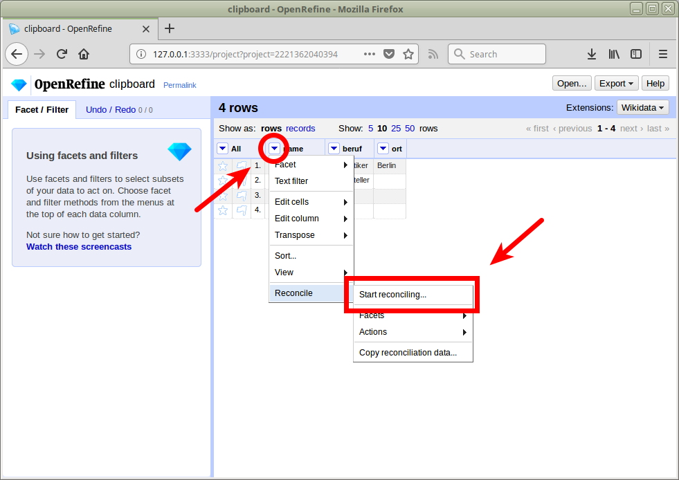

<!-- START doctoc generated TOC please keep comment here to allow auto update -->
<!-- DON'T EDIT THIS SECTION, INSTEAD RE-RUN doctoc TO UPDATE -->


- [lobid – Dateninfrastruktur für Bibliotheken](#lobid-%E2%80%93-dateninfrastruktur-f%C3%BCr-bibliotheken)
- [Überblick](#%C3%BCberblick)
    - [lobid: Schnittstellen für Entwickler\*innen und Endnutzer\*innen](#lobid-schnittstellen-f%C3%BCr-entwickler%5Cinnen-und-endnutzer%5Cinnen)
    - [Ursprung](#ursprung)
- [Technik](#technik)
    - [Warum APIs?](#warum-apis)
    - [Architektur: von horizontalen Schichten zu vertikalen Schnitten](#architektur-von-horizontalen-schichten-zu-vertikalen-schnitten)
    - [Linked Open Usable Data (LOUD) mittels JSON-LD](#linked-open-usable-data-loud-mittels-json-ld)
    - [Vokabulare](#vokabulare)
    - [Benutzerschnittstellen](#benutzerschnittstellen)
- [Entwicklungsprozess](#entwicklungsprozess)
    - [Open Source](#open-source)
    - [Visualisierung](#visualisierung)
    - [Reviews](#reviews)
- [Dokumentation](#dokumentation)
    - [Dokumentation des Datensets](#dokumentation-des-datensets)
    - [Dokumentation der API](#dokumentation-der-api)
    - [Dokumentation mit Beispielen](#dokumentation-mit-beispielen)
- [Fallstudie: lobid-gnd](#fallstudie-lobid-gnd)
    - [Suche und Navigation in der Benutzeroberfläche](#suche-und-navigation-in-der-benutzeroberfl%C3%A4che)
    - [Datengenerierung und Anreicherung](#datengenerierung-und-anreicherung)
    - [Web-API](#web-api)
    - [Formulierung komplexer Suchanfragen](#formulierung-komplexer-suchanfragen)
- [Kontakt](#kontakt)
- [Referenzen](#referenzen)

<!-- END doctoc generated TOC please keep comment here to allow auto update -->

# lobid – Dateninfrastruktur für Bibliotheken

# Überblick

## lobid: Schnittstellen für Entwickler\*innen und Endnutzer\*innen

[lobid](http://lobid.org) stellt offene Programmierschnittstellen (APIs) und Rechercheoberflächen zur Verfügung, die auf Linked Open Data (LOD) basieren. lobid wird vom Hochschulbibliothekszentrum des Landes NRW betrieben und umfasst derzeit drei Dienste: [lobid-resources](http://lobid.org/resources) bietet Zugriff auf den hbz-Verbundkatalog, [lobid-organisations](http://lobid.org/organisations) bietet Informationen zu Gedächtnisinstitutionen im deutschsprachigen Raum, [lobid-gnd](http://lobid.org/gnd) bietet Zugriff auf die Gemeinsame Normdatei (GND).

lobid richtet sich primär an Bedienstete in bibliothekarischen Einrichtungen, nicht nur in Nordrhein-Westfalen, sondern im gesamten deutschsprachigen Raum. Zum einen sind dies Bibliothekar\*innen, die etwa eine Recherche im hbz-Verbundkatalog, der GND oder dem Sigelverzeichnis vornehmen wollen. Mit der Bereitstellung zuverlässiger und leicht nutzbarer Web-APIs richtet sich lobid zum anderen an Entwickler\*innen, die am Aufbau oder der Verbesserung von bibliothekarischen Anwendungen in ihren Einrichtungen arbeiten.

## Ursprung

lobid wurde von Anfang an um die bereitzustellenden *Daten* herum konzipiert, so lautet die Auflösung des Akronyms ursprünglich "linking open bibliographic data". Die anfänglich notwendige und sich über mehrere Jahre hinziehende Propagierung der offenen Lizenzierung der Quelldaten (vgl. Pohl 2010), deren Transformation und die Modellierung der Zieldaten sowie die Auswahl der RDF-Properties und -Klassen hat dementsprechend über lange Zeit den Kern der Arbeit ausgemacht. Begonnen hat lobid 2010 mit der Bereitstellung der transformierten Daten über einen Triple Store, also einer Graphdatenbank. Der Triple Store war aber für performance-kritische Anwendungsfälle (wie einen Entity-Lookup via Textstring) nicht optimiert. Zudem gab es hohe Einstiegshürden bei der Nutzung der Daten. Um die Performanz zu optimieren und Nutzbarkeit zu erleichtern wurde das lobid-Backend 2013 auf [Elasticsearch](https://www.elastic.co/de/products/elasticsearch) mit JSON-Daten, also ein Objekt-(oder Baum)datenspeicher, umgestellt. Auf Basis unserer Erfahrungen mit dieser Version der lobid-API haben wir 2017 (lobid-resources und lobid-organisations) bzw. 2018 (lobid-gnd) die aktuellen Versionen der Dienste veröffentlicht, die wir im Folgenden beschreiben.

# Technik

## Warum APIs?

Die lobid-API bietet einheitlichen Zugriff auf bibliothekarische Daten über eine webbasierte Programmierschnittstelle ("application programming interface", API). Sie liefert JSON für Linked Data (JSON-LD):


Die Grundidee ist dabei eine Entkopplung von Anwendungen und spezifischen Datenquellen, Formaten und Systemen. So können sich diese Formate und Systeme ändern, ohne dass Änderungen in den Anwendungen nötig werden, die auf die Daten über die API zugreifen. Dies ermöglicht die Entwicklung von herstellerunabhängigen, nachhaltigen Anwendungen auf Basis bibliothekarischer Daten (siehe auch Steeg, 2015a).

## Architektur: von horizontalen Schichten zu vertikalen Schnitten

Das lobid 1.x-System basierte auf einer klassischen monolithischen Schichtenarchitektur: Wir hatten ein Git-Repository, das die Implementierung für das Backend enthielt, mit der Logik aller Datentransformationen und der Indexschicht für alle Daten. Ein weiteres Git-Repository implementierte die API und ein gemeinsames Frontend für alle Datensets, die so alle innerhalb eines Prozesses ausgeliefert wurden.

Dies führte insgesamt zu einer Verquickung der verschiedenen Datensets: um etwa auf eine neuere Version unserer Suchmaschine (Elasticsearch) umzustellen, die Features bereistellt, die wir für eines der Datensets brauchten, mussten alle Datensets umgestellt werden, da die Applikation, die ja in einem einzigen Prozess lief, nicht von verschiedenen Elasticsearch-Versionen abhängen kann. Ebenso kam es zu inhaltlich eigentlich unnötigen Abhängigkeitskonflikten zwischen Software-Bibliotheken, die jeweils nur von den APIs unterschiedlicher Datensets benötigt wurden.

Daher haben wir lobid für die 2.0-Version in vertikale, in sich abgeschlossene Systeme für jedes Datenset (resources, organisations, gnd) aufgespalten (Steeg 2015b):


Durch die Kombination dieser Module in der Horizontalen haben wir nach wie vor eine gemeinsame API und eine gemeinsame Oberfläche für alle Dienste, doch Teile dieser API und Oberfläche sind in Module gekapselt, die je ein Datenset behandeln. Diese Module enthalten den für das jeweilige Datenset spezifischen Code und die spezifischen Abhängigkeiten und können unabhängig analysiert, verändert und installiert werden.

## Linked Open Usable Data (LOUD) mittels JSON-LD

lobid hat nicht nur den Anspruch, leicht verwendbare und nützliche APIs für Entwickler*innen anzubieten, sondern war immer auch ein Linked-Data-Dienst. So hat es sich ergeben, dass lobid ein Beispiel für die Bereitstellung von *Linked Open Usable Data* wurde.

 Robert Sanderson hat den Begriff "Linked Open Usable Data" (LOUD) geprägt, um eine Form der Linked-Open-Data-Publikation voranzutreiben, die Software-Entwickler\*innen und deren Konventionen und Bedürfnisse in den Vordergrund stellt (vgl. Sanderson 2016 sowie Sanderson 2018). Die Anforderungen an LOUD fasst Sanderson (2018), Folie 22 wie folgt zusammen (Übersetzung/Paraphrase von uns):

- der Zielgruppe angemessene Abstraktion
- wenig Einstiegshürden
- unmittelbar verständliche Daten
- Dokumentation mit funktionierenden Beispielen
- wenig Ausnahmen, möglichst einheitliche Struktur

Das lobid-Team hat sich in dieser – zugegebenermaßen eher ungenauen – Begriffsbestimmung wiedergefunden und erkannt, dass die LOUD-Prinzipien eine große Überschneidung mit Konzepten der Datenpublikation von lobid haben. So spielt etwa bei der Erfüllung der LOUD-Anforderungen JSON-LD eine zentrale Rolle, sollen doch alle Daten konsistent mit Blick auf JSON-LD modelliert werden (Sanderson 2018, Folien 32 und 37ff). Seit 2013 setzt lobid bereits auf JSON-LD.

JSON-LD ist eine W3C-Empfehlung für eine JSON-basierte Linked-Data-Serialisierung. Man kann JSON-LD aus zwei Perspektiven betrachten: einerseits als RDF-Serialisierung (wie N-Triples, Turtle oder RDF/XML), andererseits als eine Möglichkeit, JSON zum Verlinken von Daten zu verwenden. Diese doppelte Perspektive spiegelt sich auch in der JSON-LD-Spezifikation wider, die beschreibt dass JSON-LD "als RDF verwendet werden kann", aber auch "direkt als JSON, ohne Kenntnis von RDF" (Sporny (2014), Übersetzung von uns). Reguläres JSON wird durch das [Beifügen eines JSON-LD-Kontexts](https://www.w3.org/TR/json-ld/#the-context) zu JSON-LD und damit als RDF serialisierbar.

In Folgenden wird dargestellt, wie die aktuellen lobid-Daten gegenüber dem 1.x-System verbessert wurden, und so die Anforderungen an Linked Open Usable Data umfassender erfüllt werden.

### Generisches JSON-LD im lobid 1.x-System

Da lobid von 2010 bis 2013 die Daten in einer Graphdatenbank speicherte erzeugten die vorhandenen Datentransformationsprogramme N-Triples. In der ersten Version der lobid-APIs haben wir diese Datentransformationsprogramme wiederverwendet und die N-Triples automatisch mit einem JSON-LD-Prozessor konvertiert. Hier haben wir JSON-LD vollständig als RDF-Serialisierung betrachtet:


Die Property URIs der Triple wurden im JSON-LD zu JSON-Schlüsselwörtern. Diese Daten haben wir als [expandiertes JSON-LD](https://www.w3.org/TR/json-ld/#expanded-document-form) in Elasticsearch indexiert (Beispiel gekürzt):

```json
{
  "@graph" : [{
    "@id" : "http://d-nb.info/gnd/11850553X",
    "http://d-nb.info/standards/elementset/gnd#preferredNameForThePerson" : [{
      "@value" : "Bach, Johann Sebastian"
    }],
    "http://d-nb.info/standards/elementset/gnd#biographicalOrHistoricalInformation" : [{
      "@value" : "Sohn: Bach, Friedemann",
      "@language" : "de"
    },{
      "@language" : "de",
      "@value" : "Dt. Komponist u. Musiker"
    }],
    "http://d-nb.info/standards/elementset/gnd#placeOfBirth" : [{
      "@id" : "http://d-nb.info/gnd/4014013-1"
    }]
  }]
}

```

Elasticsearch erfordert konsistente Daten für ein gegebenes Feld, z. B. muss etwa der Wert des Feldes `alternateName` immer ein String sein, oder immer ein Array. Wenn die Werte mal ein String, mal ein Array sind, führt dies bei der Indexierung in Elasticsearch zu einem Fehler. In der kompakten JSON-LD-Serialisierung werden einzelne Werte direkt serialisiert (z. B. als String), wenn jedoch in einem anderen Dokumente für das gleiche Feld mehrere Werte angegeben sind, wird ein Array verwendet. Expandiertes JSON-LD verwendet hingegen immer Arrays. Eine JSON-LD-Form, bei der kompakte Keys (Schlüsselwörter) mit expandierten Werten kombiniert sind gibt es derzeit nicht (siehe [https://github.com/json-ld/json-ld.org/issues/338](https://github.com/json-ld/json-ld.org/issues/338)).

Beim Ausliefern der Daten über die API haben wir die Daten dann in [kompaktes JSON-LD](https://www.w3.org/TR/json-ld/#compacted-document-form) konvertiert, um anstelle der URIs kurze, benutzerfreundliche JSON Keys zu bekommen (Beispiel gekürzt):

```json
{
  "@graph" : [ {
    "@id" : "http://d-nb.info/gnd/11850553X",
    "preferredNameForThePerson" : "Bach, Johann Sebastian",
    "biographicalOrHistoricalInformation" : [ {
      "@language" : "de",
      "@value" : "Sohn: Bach, Friedemann"
    }, {
      "@language" : "de",
      "@value" : "Dt. Komponist u. Musiker"
    } ],
    "placeOfBirth" : "http://d-nb.info/gnd/4014013-1"
  }]
}
```

Das heißt wir haben im Grunde zwei verschiedene Formate erzeugt und verwendet: das interne Indexformat und das extern sichtbare API-Format.

### Maßgeschneidertes JSON-LD in den neuen Systemen

#### Maßgeschneidertes JSON mit Kontext für JSON-LD: lobid-organisations

Bei lobid-organisations, dem ersten Datenset, das wir auf den neuen Ansatz umgezogen haben, haben wir das Vorgehen umgedreht – statt manuell N-Triples anzufertigen, und diese automatisch in JSON-LD zu konvertieren, erzeugen wir das JSON mit genau der Struktur, die wir brauchen. Auf dieser Grundlage generieren wir dann RDF-Serialisierungen wie N-Triples:


Der zentrale Vorteil dieses Ansatzes ist, dass wir unseren konkreten Anwendungsfall nach vorne stellen: Wir bauen explizit unsere API so, wie sie für unsere Anwendungen Sinn macht, anstatt zuerst eine Abstraktion zu erzeugen, aus der wir dann konkrete Darstellungen generieren, die von unseren Anwendungen verwendet werden.

Im Vergleich zum Ansatz im ersten lobid-System befinden wir uns hier am anderen Ende des Spektrums der Perspektiven auf JSON-LD, die wir oben beschrieben haben: Wir behandeln hier JSON-LD als JSON, ohne bei der Produktion der Daten, oder bei ihrer Verwendung, Kenntnisse von RDF zu erfordern.

#### Maßgeschneidertes JSON-LD nach RDF-Serialisierung: lobid-resources

In der neuen Version von lobid-resources haben wir einen Mittelweg genommen. Wir haben uns entschlossen, auf die bestehende Transformation der Katalogdaten in N-Triples aufzubauen. Wir verwenden Code, der von Jan Schnasse im Etikett-Projekt (Schnasse/Christoph 2018) entwickelt wurde, um maßgeschneidertes JSON-LD aus den N-Triples zu erzeugen. Wie in lobid-organisations (und im Gegensatz zur ersten Version von lobid-resources), ist das maßgeschneiderte JSON-LD zugleich das Index- wie auch das von der API gelieferte Format.

#### Maßgeschneiderte RDF-Serialisierung für JSON-LD: lobid-gnd

Auch in lobid-gnd erzeugen wir für Index und API dasselbe Format als RDF-Serialisierung. In diesem Fall liegen unsere Ausgangsdaten bereits als RDF vor, und werden mithilfe eines detaillierten JSON-LD-Kontexts und JSON-LD-Framing, sowie einigen Anpassungen am RDF-Modell, in das gewünschte Format umgewandelt. Details dazu finden sich weiter unten im Abschnitt zu lobid-gnd.

### Vorteile des maßgeschneiderten JSON-LD

Alle drei Ansätze erzeugen also maßgeschneidertes JSON-LD, sei es auf spezifische Weise aus RDF generiertes oder manuell erzeugtes JSON. Dieses maßgeschneiderte JSON-LD hat mehrere Vorteile.

#### Was man sieht, ist was man abgefragen kann

Ein zentraler Aspekt der neuen Systeme ist, dass wir nun das gleiche Format liefern, das auch im Index gespeichert ist. Dies ermöglicht beliebige Abfragen der Daten über generische Mechanismen, ohne dass wir spezifische Anfragen implementieren müssen. Betrachten wir etwa einen bestimmten Datensatz, z. B. [http://lobid.org/organisations/DE-605.json](http://lobid.org/organisations/DE-605.json), so sehen wir folgendes:

	"classification" : {
	  "id" : "http://purl.org/lobid/libtype#n96",
	  "type" : "Concept",
	  "label" : {
	    "de" : "Verbundsystem/ -kataloge",
	    "en" : "Union Catalogue"
	  }
	}

Auf Basis der Daten, die wir hier sehen, können wir ein beliebiges Feld nehmen, z. B. `classification.label.en` (die Punkte bilden die Schachtelung der Felder ab) und eine Abfrage wie `http://lobid.org/organisations/search?q=classification.label.en:Union` formulieren. Im alten System, bei dem im Index expandiertes JSON-LD gespeichert war, die API aber kompaktes JSON-LD lieferte (s. Beispiele oben), brauchten wir spezifische Parameter, um Feldsuchen, etwa für Titel, Autoren oder Schlagwörter, in praxistauglicher Art umzusetzen (ohne URIs als Feldnamen, die wiederum komplexes Maskieren von Sonderzeichen erfordern), z. B.: `http://lobid.org/resource?name=Ehrenfeld`. Diese können nun stattdessen über einen generischen `q`-Parameter und die tatsächlichen Feldnamen aus den Daten formuliert werden: `http://lobid.org/resources/search?q=title:Ehrenfeld`. So vermeiden wir eine Beschränkung auf die von uns antizipierten Arten von Abfragen, haben eine Suchsyntax, die sich an den Feldnamen orientiert und öffnen gleichhzeitig die kompletten Daten für den API-Zugriff.

#### Hierarchisch strukturierte Daten

Das generierte JSON-LD des alten Systems war eine flache Struktur mit JSON-Objekten in einem Array unter dem `@graph`-Schlüsselwort, z. B. in `http://lobid.org/organisation?id=DE-605&format=full`:

	"@graph": [
	    {
	        "@id": "http://purl.org/lobid/fundertype#n02",
	        "prefLabel": [{
	                "@language": "de",
	                "@value": "Land"
	            },{
	                "@language": "en",
	                "@value": "Federal State"
	        }]
	    },{
	        "@id": "http://purl.org/lobid/stocksize#n11",
	        "prefLabel": [{
	                "@language": "en",
	                "@value": "Institution without a collection"
	            },{
	                "@language": "de",
	                "@value": "Einrichtung ohne Bestand"
	        }]
	    }
	]

Diese Struktur war nicht sehr praktisch und entsprach nicht dem pragmatischen Geist von JSON-LD (vgl. Steeg 2014). Wenn man etwa automatisch die englische Bezeichnung des Unterhaltsträgers einer Einrichtung verwenden will, muss man hier über alle `@graph`-Objekte iterieren und jeweils prüfen, ob die `@id` die Unterhaltsträger-ID ist, dann über alle `prefLabel`-Objekte iterieren und jenes mit dem passenden `@language`-Feld suchen, das dann als `@value` den gesuchten Wert enthält.

In den neuen Systemen bieten wir die Daten in einem geschachtelten, JSON-typischem Format an:

	"fundertype": {
	    "id": "http://purl.org/lobid/fundertype#n02",
	    "type": "Concept",
	    "label": {
	        "de": "Land",
	        "en": "Federal State"
	    }
	},
	"collects": {
	    "type": "Collection",
	    "extent": {
	        "id": "http://purl.org/lobid/stocksize#n11",
	        "type": "Concept",
	        "label": {
	            "de": "Einrichtung ohne Bestand",
	            "en": "Institution without holdings"
	        }
	    }
	}

Dies ermöglicht einen einfacheren, direkteren Zugriff auf die Daten. Das gesuchte Datum aus dem obigen Beispiel etwa ist statt über mehrere Schleifen und Zeichenkettenvergleiche hier per Direktzugriff auf das geschachtelte Feld `fundertype.label.en` verfügbar.

#### Labels für IDs

Ein typisches Nutzungsszenario bei der Verwendung der lobid-APIs ist die Anzeige von Labels für die URIs, die zur Identifikation von Ressourcen, Autoren, Schlagwörtern etc. verwendet werden. Für Anwendungen, die auf dem alten System basierten, haben wir das Nachschlagen dieser Labels in unterschiedlichen Formen implementiert. Um diesen Anwendungsfall zu vereinfachen, liefern die neuen APIs die Labels mit den IDs zusammen aus, soweit dies möglich und sinnvoll ist.

In den alten Daten hatten wir etwa zu Identifikation des Mediums einer Publikation nur einen URI:

	"medium" : "http://rdvocab.info/termList/RDAproductionMethod/1010"

Um nun ein Label für einen solchen URI anzuzeigen, mussten wir in den Client-Anwendungen, die die lobid-APIs nutzten, Zuordnungen etwa in Form von Mapping-Tabellen verwalten. In den neuen APIs liefern wir die Labels mit den IDs zusammen aus (aus Konsistenzgründen wird auch hier auf oberster Ebene ein einzelner Wert als Array geliefert, s.o.):

	"medium": [{
	  "id": "http://rdaregistry.info/termList/RDAproductionMethod/1010",
	  "label": "Print"
	}]

Wie die Erstellung des JSON-LD allgemein, unterscheidet sich auch die Implementierung dieser Labels zwischen der oben beschriebenen Umsetzungen. In lobid-organisations ist die Ergänzung der Labels (wie alle Aspekte der JSON-Erzeugung) Teil der Datentransformation. In lobid-resources wird eine `labels.json`-Datei während der Konvertierung von N-Triples in JSON-LD verwendet. lobid-gnd schließlich verwendet ein Bootstrapping-Ansatz, bei dem die vorige Version des Dienstes als Quelle für die Labels verwendet wird, ergänzt um weitere Quellen wie die GND-Ontologie. Details zur Datentransformation in lobid-gnd finden sich weiter unten.

#### Zwischenfazit: JSON-LD ist nicht gleich JSON-LD

Eine zentrale Schlussfolgerung unserer Erfahrung mit JSON-LD ist, dass JSON-LD sehr unterschiedlich erzeugt und verwendet werden kann. Wie es erzeugt wird hat dabei große Auswirkungen darauf, wie es verarbeitet werden kann und wie nützlich es je nach fachlichem Hintergrund erscheint. Eine reine RDF-Serialisierung wie in unserem alten System kann etwa perfekt passen, wenn sowieso mit einem RDF-Modell gearbeitet wird, während sie Web-Entwicklern und Entwicklerinnen, die mit JSON vertraut sind, als absurd und schwer verwendbar erscheinen wird. Diese Unterschiede in dem, wie JSON-LD tatsächlich aussieht, können eine Herausforderung für die Kommunikation über die Nützlichkeit von JSON-LD sein. Zugleich ist dies aber auch eine Stärke von JSON-LD, das mit seiner Doppelnatur – als RDF-Serialisierung und als einfacher Weg, JSON-Daten zu vernetzen – unterschiedliche Nutzungsszenarien abdecken kann.

## Vokabulare

Ein zentraler Aspekt jeder Linked-Data-Anwendung sind die genutzten RDF-Vokabulare und Ontologien. In [lobid-organisations](http://lobid.org/organisations) verwenden wir schema.org als Basisvokabular. lobid-resources basiert auf DC Terms, Bibframe, der Bibliographic Ontology (Bibo), schema.org und anderen, siehe für Details Ewertowski/Pohl (2017). Grundlage der Daten in lobid-gnd ist die GND-Ontologie (Haffner 2018).

## Benutzerschnittstellen

Über die hier skizzierten APIs und Datenstrukturen hinaus bietet [lobid](http://lobid.org) in der neuen Version (im Gegensatz zur rudimentären Darstellung der alten Dienste) Suchoberflächen für Endnutzer\*innen mit erweiterten Funktionen wie facettierter Suche und Kartenvisualisierungen. Eine ausführliche Darstellung der Funktionalitäten am Fallbeispiel lobid-gnd findet sich unten im Abschnitt "Suche und Navigation in der Benutzeroberfläche".

# Entwicklungsprozess

Das lobid-Kernteam besteht seit 2012 aus den drei Autoren dieses Artikels, d. j. eine bibiothekarische Fachkraft und zwei Entwickler. 2017/18 war Christoph Ewertowski Teil des Teams und hat uns stark im bilbiothekarischen Bereich unterstützt, insbesondere bei der Verbesserung der Datentransformation. Insgesamt werden für die (Weiter-)Entwicklung und den Betrieb von lobid je nach anstehenden Aufgaben und sonstigen laufenden Projekten etwa 1,5 bis 2,5 Vollzeitäquivalente eingesetzt. Im folgenden wird skizziert, wie die Teammitglieder die Arbeit an der Entwicklung von lobid organisieren.

## Open Source

Wir entwickeln die lobid-Dienste als Open Source Software auf GitHub. Wir veröffentlichen nicht nur Ergebnisse auf GitHub, sondern der gesamte Prozess findet dort statt, d.h. Planung, Issue Tracking & Diskussion, Pull Requests, Implementierung sowie Testen der Software. GitHub hat einen integrierten Issue Tracker, dessen primäres Organisationsmittel beliebige Labels mit Farben sind. Diese lassen sich vielseitig anwenden (s.u.). Dieser Issue Tracker ermöglicht es auf einfache und funktionale Weise, andere Prozesse in GitHub zu referenzieren, so lassen sich etwa auf einfache Weise Links zu Code, Commits und Benutzern erstellen.

## Visualisierung

GitHub Issues sind immer mit einem GitHub Code Repository assoziiert. Für die Bereitstellung von lobid.org werden derzeit [neun Repositories](https://github.com/search?q=topic%3Alobid+org%3Ahbz&type=Repositories) auf GitHub verwendet, dazu kommen weitere Repositories etwa für das [lobid Blog](http://blog.lobid.org/). Für einen einheitlichen Blick auf alle vom Team bearbeiteten Issues in allen Repositories verwenden wir zur Visualisierung des Workflows [Waffle](http://waffle.io), ein Kanban Board mit GitHub-Integration, bei dem jedes GitHub Issue einer Karte entspricht, und die Spalten des Boards Labels der GitHub-Issues entsprechen.


In unserem Prozess durchläuft eine Karte das Board von links nach rechts. Priorisierte Karten schieben wir nach oben in der Spalte, Karten, die Fehler (Bugs) beschreiben, werden generell priorisiert.

| Backlog | Ready | Working | Review | Deploy | Done |
|---------|-------|---------|--------|--------|------|
| Neue Issues ohne Label | Bereit, d.h. Anforderungen und Abhängigkeiten sind klar | In Bearbeitung | In Überprüfung | Bereit für Produktion | In Produktion |

## Reviews

Ein Kernelement unseres Entwicklungsprozesses, durch das bibliothekarische Anforderungen und Entwicklung miteinander verzahnt werden, sind die Begutachtungen bzw. Reviews. Hier unterscheiden wir zwischen funktionalem Review, einer fachlich-inhaltlichen Begutachtung aus bibliothekarischer Sicht, und Code Review, einer implementationstechnischen Begutachtung aus Entwicklungssicht.

Zur Einleitung des funktionalen Reviews stellt einer unserer Entwickler neue oder reparierte Funktionalität auf dem Testsystem bereit, beschreibt im korrespondierenden Issue, wie getestet werden kann (z. B. durch Angabe von Links auf die betreffenden Seiten im Testsystem) und weist das Issue einem Team-Mitglied zur Begutachtung zu. Dieses testet, gibt Feedback (bei Bedarf aktualisiert der Entwickler den Code und die Version auf dem Testsystem mehrfach), und schließt die Begutachtung mit einem "+1" Kommentar ab.

Nach Abschluss des funktionalen Reviews weist der Begutachter den zum Issue gehörigen Pull Request einem anderen Entwickler zur Begutachtung zu (Code Review). Dieser inspiziert je nach Fall nur den Diff im Pull Request oder testet den Branch lokal. Die Ausführung des Builds und der Tests erfolgt automatisch im Pull Request durch Travis CI, ein in GitHub integrierter Continuous-Integration-Dienst. Auch hier wird die Begutachtung mit einem "+1" Kommentar abgeschlossen, der Begutachter weist das Issue wieder dem Entwickler zu, und verschiebt es in 'Deploy'.

Nach Abschluss beider Begutachtungsschritte wird die neue bzw. reparierte Funktionalität auf dem Produktivsystem installiert. Details zu unserem Entwicklungsprozess finden sich in unserer [Dokumentation](https://hbz.github.io/#dev-process) und in Steeg (2016).

# Dokumentation

Bei der Dokumentation einer API gibt es unterschiedliche Aspekte: das Datenset als Ganzes, die Struktur von API-Anfragen und -Antworten, die verwendeten RDF-Properties und -Klassen, Provenienzinformationen. Im Folgenden beschreiben wir unsere Herangehensweise an die Dokumentation von [lobid-resources](https://lobid.org/resources/) und [lobid-organisations](https://lobid.org/organisations/), mit dem Schwerpunkt auf letzterem Dienst.

## Dokumentation des Datensets

Um für die menschliche und maschinelle Nutzung der Daten einen Überblick zu geben, folgen wir im Wesentlichen der W3C-Empfehlung für Daten im Web (Lóscio 2017). Das Ergebnis ist [eine JSON-LD-Datei](http://lobid.org/organisations/dataset.jsonld) und eine daraus generierte [HTML-Version](http://lobid.org/organisations/dataset). Im Gegensatz zu den Beispielen der W3C-Empfehlung verwenden wir so weit wie möglich Vokabular von schema.org anstatt DC Terms und des DCAT-Vokabulars. HTML-Version der lobid-organisations Datenset-Beschreibung:


## Dokumentation der API

Die API-Dokumentation ([lobid-organisations](http://lobid.org/organisations/api), [lobid-resources](http://lobid.org/resources/api), [lobid-gnd](http://lobid.org/gnd/api)) führt zunächst grundlegende Konzepte der API anhand von Beispielen ein und zeigt darauf aufbauend komplexere Anfragen und spezielle Fälle wie die Suche nach URLs (in denen bestimmt Zeichen maskiert werden müssen). Für eine vollständige Referenz zur den Suchmöglichkeiten verweisen wir auf die Lucene-Dokumentation (Elasticsearch basiert auf Lucene und verwendet eine kompatible Abfragesyntax).

Im weiteren Verlauf beschreibt die Dokumentation die unterstützten Inhaltstypen mit Beispielanfragen. Wir beschreiben den Einsatz der API zur Umsetzung einer Autosuggest-Funktionalität mit einem in die Dokumentationseite eingebetteten, funktionstüchtigen Beispiel. Schließlich beschreiben wir spezifische Funktionen der einzelnen Dienste wie ortsbezogene Abfragen, CSV-Export, und die Integration der APIs in OpenRefine (siehe dazu auch unten).

## Dokumentation mit Beispielen

Um einen leichten Zugang zu einem Schema und seiner Verwendung zu bekommen, wird häufig nach Beispielen gesucht. Leider sind Beispiele aber oft nur zweitrangige Elemente einer Dokumentation, wenn überhaupt welche gegeben werden. Sehr verbreitet ist ein beschreibender Ansatz zur Dokumentation von Vokabularen oder Applikationsprofilen, bei dem Elemente in einer Tabelle (häufig in einem PDF) aufgelistet werden, mit Beschreibungen verschiedener Aspekte in mehreren Spalten.

Eine Ausnahme ist hier schema.org, das viele Beispiele bietet. Aber selbst hier sind die Beispiele ein Anhängsel der Beschreibung und manchmal fehlen sie (z. B. ist es schwierig zu erfahren, wie die Property [`publication`](http://schema.org/publication) oder die Klasse [`PublicationEvent`](http://schema.org/PublicationEvent) verwendet werden). Wir sind der Ansicht, dass Beispiele Kernelemente der Dokumentation sein sollten und halten seitenlange Tabellen, die Elemente eines Metadatenschemas auflisten, nicht für sehr hilfreich und praktisch. Daher haben wir uns Gedanken gemacht und damit experimentiert, wie Beispiele ins Zentrum der Dokumentation gerückt werden können.

### Web-Annotationen für API-Dokumentation

Beispiele alleine sind nicht hinreichend (Gruenbaum 2009), aber brauchen wir wirklich eine Tabelle, in der jedes Element unserer Daten beschrieben wird? Wenn wir das Beispiel in den Mittelpunkt stellen, können wir die strukturierten beschreibenden Daten (Name, Beschreibung, etc.) direkt dem Beispiel beifügen?

Hier kommen Werkzeuge zur Web-Annotation zur Anwendung, indem Beispiele unserer JSON-LD Daten aus dem Produktivsystem mit [hypothes.is](https://hypothes.is/) annotiert werden. (Unser erster Ansatz war, direkt die JSON-Darstellungen zu annotieren (z. B. [http://lobid.org/organisations/DE-38M.json](http://lobid.org/organisations/DE-38M.json)), doch hier würden die Annotationen nur bei Verwendung des [hypothes.is Chrome-Plugins](https://chrome.google.com/webstore/detail/hypothesis-web-pdf-annota/bjfhmglciegochdpefhhlphglcehbmek) sichtbar. Eine weitere Option wäre die Verwendung des hypothes.is [via service](https://via.hypothes.is/), doch dieser [unterstützt keine Annotation von Textdateien](https://github.com/hypothesis/via/issues/79). Daher haben wir uns entschlossen, die JSON-Beispiele in die HTML-Dokumentationsseite einzubetten, und hypothes.is über JavaScript einzubinden.)

In lobid-organisations reicht die Annotation eines einzigen Beispiels aus. Um die wesentlichen Felder in den lobid-resources-Daten abzudecken, mussten wir je ein Beispiel verschiedener Ressourcentypen (Buch, Periodikum, Artikel, Serienband) annotieren. Für lobid-gnd haben wir den Annotationsansatz noch nicht umgesetzt.

Zum Zwecke der Dokumentation wird jedes JSON-Schlüsselwort wird mit den folgenden Informationen annotiert:

- *Name*: eine menschenlesbare Bezeichnung für das Feld
- *Beschreibung*: eine kurze Beschreibung der Information in diesem Feld
- *Abdeckung*: die Anzahl der Ressourcen im Datenset mit Informationen in diesem Feld. Hier ergänzen wir häufig URLs mit `_exists_`-Abfragen (siehe unten) dieses Feldes.
- *Anwendungsfälle*: Beispiele zur Verwendung der Information in diesem Feld, häufig mit Beispielanfragen
- *URI*: die RDF-Property, die diesem Feld entspricht (d.h. die auf den JSON-Key im JSON-LD-Kontext gemappte URI)
- *Provenienz*: Informationen über die Felder in den Quelldaten, aus denen die Information in diesem Feld erzeugt wurde

Die ersten beiden Punkte (Name und Beschreibung) sowie die URI werden bei allen Keys angegeben, die anderen Werte sind (noch) nicht überall verfügbar. Wir versuchen durch Beispielanfragen in den Annotationen ein Gefühl für Möglichkeiten zur Nutzung der API zu vermitteln, insbesondere in den Abschnitten 'Abdeckung' und 'Anwendungsfälle'.

Unter [http://lobid.org/organisations/api](http://lobid.org/organisations/api/de) kann man die annotationsbasierte Dokumentation in Aktion sehen (für lobid-resources siehe [http://lobid.org/resources/api](http://lobid.org/resources/api)). Im [Abschnitt zu JSON-LD](http://lobid.org/organisations/api#jsonld) öffnet sich durch einen Klick auf die hervorgehobenen JSON-Keys die hypothes.is-Seitenleiste mit Informationen über das entsprechende Element. Beispielannotation für das "rs" Feld:


### Vorteile

Die Beispiele, die zur Dokumentation annotiert werden, sollten im besten Fall Live-Daten aus dem Produktivsystem sein. So ist gewährleistet, dass bei Änderungen in den Daten das Beispiel, und damit die Dokumentation, automatisch aktuell bleibt. Dies verhindert manuellen Synchronisationsaufwand zwischen Daten und Dokumentation.

Wir hoffen und glauben, dass dieser Ansatz zur Dokumentation nützlicher ist als der traditionelle beschreibende Ansatz. Er bietet Nutzenden eine intuitive und interaktive Schnittstelle um die Daten der lobid-APIs zu erkunden und zu verstehen. Bei Fragen oder Unklarheiten kann innerhalb der hypothes.is-Seitenleiste auf die Annotationen geantwortet werden. So können spezifische Teile der Dokumentation im direkten Kontext derselben diskutiert werden.

# Fallstudie: lobid-gnd

Mit lobid-gnd bietet das hbz eine Schnittstelle zur GND für Mensch und Maschine an. Über [https://lobid.org/gnd](https://lobid.org/gnd) gibt es Zugriff auf alle GND-Entitäten. Da es sich bei lobid-gnd zum einen um den Dienst handelt, der die meisten Menschen interessieren dürfte und zum anderen um den letzten lobid-Dienst, der in Version 2 gestartet wurde, nutzen wir ihn als Beispiel für eine detaillierte Betrachtung der Nutzungsmöglichkeiten von lobid.

## Suche und Navigation in der Benutzeroberfläche

Auf der Startseite von lobid-gnd findet sich neben einer kurzen Beschreibung des Dienstes ein Suchschlitz. Außerdem wird – wie auch in [lobid-organisations](https://lobid.org/organisations) – mit jedem Laden der Seite ein zufälliges Bild zu einer GND-Ressource angezeigt. Momentan gibt es [knapp 200.000 Einträge mit Bild](http://lobid.org/gnd/search?q=_exists_%3Adepiction), davon sind die meisten Personen. Wer also Lust hat, die GND ein wenig näher kennenzulernen, kann ja mal die Startseite ein paar Mal neu laden.

Die einfache Suchoberfläche auf der Startseite unterstützt unter anderem Boolesche Operatoren, Phrasensuche und Trunkierung:


Nach der Eingabe im Suchfeld kann einer der Vorschläge direkt ausgewählt werden, um zur Detailansicht zu gelangen:


Über die Enter-Taste oder das Lupen-Icon kann eine Suche angestoßen werden:


Als alternativer Einstieg kann die gesamte GND erkundet werden:


Über beide Wege kommt man zur Trefferliste. Über den Treffern auf der linken Seite kann die Anzahl der Treffer pro Seite gewählt werden, darunter kann zwischen den Seiten gewechselt werden:


Auf der rechten Seite ermöglicht eine facettierte Suche nach *Entitätstyp*, *GND-Sachgruppe*, *Ländercode* und *Beruf oder Beschäftigung* eine Eingrenzung der Ergebnisse:


Als Standard werden in jeder Facette die fünf häufigsten Einträge angezeigt, weitere Einträge lassen sich ein- und ausblenden:


Entitätstypen sind in Untertypen differenziert:


Über die Auswahl unterschiedlicher Facetten lässt sich die Treffermenge präzise eingrenzen, z. B. zur Anzeige [aller hydrologischen Geografika in Nordrhein-Westfalen](http://lobid.org/gnd/search?filter=%2B(type%3ANaturalGeographicUnit)+%2B(gndSubjectCategory.id%3A%22http%3A%2F%2Fd-nb.info%2Fstandards%2Fvocab%2Fgnd%2Fgnd-sc%2319.3%22)+%2B(geographicAreaCode.id%3A%22http%3A%2F%2Fd-nb.info%2Fstandards%2Fvocab%2Fgnd%2Fgeographic-area-code%23XA-DE-NW%22)):


Erweiterte Suchmöglichkeiten ergeben sich aus einer Kombination von Sucheinstieg über das Suchfeld und facettierter Suche sowie über Mehrfachauswahl innerhalb einer Facette:


Der Klick auf einen Suchtreffer führt zu einer Detailansicht. Die Detailseiten enthalten Links zu verknüpften GND-Einträgen. Über die Lupen-Icons kann eine Suche nach Einträgen mit der gleichen Beziehung angestoßen werden, z. B. [alle Teile der Nordsee](https://lobid.org/gnd/search?q=broaderTermPartitive.id%3A%22http%3A%2F%2Fd-nb.info%2Fgnd%2F4042579-4%22&size=50&format=html):


Die visuelle Darstellung im Tab "Beziehungen" erlaubt ebenso eine Navigation zu den verknüpften Entitäten per Klick auf einen Knoten des Graphs und eine Suche nach weiteren Einträgen mit der gleichen Beziehung per Klick auf eine Kante:


Das Piktogramm  verweist auf die dem Eintrag zugrundeliegenden strukturierten Daten im Format JSON-LD. Im folgenden wird die Herkunft, Aktualität und Struktur dieser Daten erläutert, um daran anschließend vorzustellen, wie komplexere Suchanfragen formuliert werden können.

## Datengenerierung und Anreicherung

lobid-gnd ist – neben seiner Funktion als Endnutzerschnittstelle – auch eine Maschinenschnittstelle zur GND. Die Endnutzerschnittstelle basiert auf HTML für die Ansicht im Browser, aber ebenso liefern alle HTTP-GET-Anfragen auf Wunsch JSON(-LD) für die maschinelle Verarbeitung etwa zur Anwendungsentwicklung. Bevor wir aber näher auf die Web-API (_Application Programming Interface_, deutsch: Entwicklungsschnittstelle) eingehen, möchten wir zunächst beschreiben, wie und in welcher Form die GND-Daten indexiert werden.

Die Datenquelle sind die RDF-Daten der GND, die von der Deutschen Nationalbliothek (DNB) [bereitgestellt](http://www.dnb.de/DE/Service/DigitaleDienste/LinkedData/linkeddata_node.html) werden. Das hbz hat Zugriff auf eine OAI-PMH-Schnittstelle der DNB, über die täglich Updates der Daten geholt werden. Diese Daten werden dann für lobid-gnd mit einigen Anpassungen nach JSON-LD konvertiert. Zum Teil waren diese Anpassungen durch Inkonsistenzen in den Ausgangsdaten bedingt, was wir zum Anlass genommen haben, Verbesserungen vorzuschlagen, die zum Teil bereits durch die DNB umgesetzt wurden.

### Der JSON-LD-Kontext

Die meiste Arbeit zur Optimierung der Datenstruktur übernimmt der JSON-LD-Kontext unter [https://lobid.org/gnd/context.jsonld](https://lobid.org/gnd/context.jsonld). Er bewirkt unter anderem folgende Dinge:

- Der Kontext bestimmt, welche JSON-Keys auf welche RDF-Properties gemappt werden, so dass im JSON nicht lange URIs als Keys angezeigt werden.
- Mit Einträgen wie `"AuthorityResource": "http://d-nb.info/standards/elementset/gnd#AuthorityResource"` werden Typen (`type`) im JSON nicht als umständliche URI, sondern als einfacher String angezeigt, so dass die Daten auch leicht verständlich sind für Entwickler*innen, die bisher nicht viel mit Linked Data gearbeitet haben.
- Mittels `"@container": "@set"` wird festgelegt, dass bis auf wenige Ausnahmen alle Properties ein Array als Wert haben, auch wenn es in einem Eintrag nur ein Element als Wert gibt. Dadurch ist die Datenstruktur homogener und vorhersagbarer. Dies spielt etwa für die Indexierung in Elasticsearch eine Rolle, da hier wie bereits gesagt ein bestimmtes Feld immer den gleichen Datentypen (z. B. Array) haben muss. Auch bei der Nutzung der API erleichtert dies die Verarbeitung, da für ein bestimmtes Feld immer von einem identischen Typ ausgegangen werden kann. Im Zusammenspiel mit [entsprechend konfigurierter](https://json-ld.org/spec/latest/json-ld-api/#dom-jsonldoptions-compactarrays) Verarbeitung des JSON-LD ermöglicht dies eine gezielte Konfiguration einzelner Felder.

### Framing

Wir nutzen einen einfachen JSON-LD Frame (Longley et al. 2018), um das JSON in eine hierarchische JSON-Struktur mit einem Wurzelelement zu bringen. Dieser Frame verwendet den gleichen Kontext wie die eigentlichen Einträge, definiert als Typ die Oberklasse aller Einträge und bestimmt, dass der Inhalt immer eingebettet werden soll:

```
{
  "@context": "http://lobid.org/gnd/context.jsonld",
  "@type": "AuthorityResource",
  "@embed": "@always"
}
```

### Homogenisierung von Typen und Label-Properties

Damit das Framing bei jeder GND-Entität funktioniert, muss allen Entitäten der Typ `AuthorityResource` zugewiesen sein. Hier kommen wir zum Punkt, wo wir die Daten der DNB ergänzen, um bestimmte Funktionalitäten zu ermöglichen. Das von der DNB gelieferte [RDF zum Eintrag von Hannah Arendt](https://d-nb.info/gnd/11850391X/about/lds) enthält zum Beispiel folgende Informationen (in Turtle-Notation):

```
@prefix gndo: <http://d-nb.info/standards/elementset/gnd#> .

<http://d-nb.info/gnd/11850391X> a gndo:DifferentiatedPerson ;
  gndo:preferredNameForThePerson "Arendt, Hannah" ;
  gndo:variantNameForThePerson "Blücher, Johanna" .
```

Wie man sieht, wird hier nur die spezifische Klasse (`gndo:DifferentiatedPerson`) angegeben und es werden typspezifische Properties (`gndo:preferredNameForThePerson`, `gndo:variantNameForThePerson`) zur Angabe der Ansetzungs- und Verweisungsformen verwendet. Dies mag für eine Abfrage der Daten über einen SPARQL-Endpoint ausreichend sein, weil die GND-Ontologie (Haffner 2018) Informationen zu  Überklassen und -Properties enthält und somit mit Unterstützung von Reasoning auch entsprechende Abfragen funktionieren. Für eine einheitliche Abfrage der Ansetzungsformen aller GND-Entitäten in einem Suchmaschinenindex und der damit einhergehenden einfachen Bereitstellung von Filtermöglichkeiten nach Oberklassen (Person, Schlagwort, Körperschaft, Geografikum etc.) über eine Web-API reicht das aber nicht aus. Statt etwa einer Suche über alle Daten im Feld `preferredName` müsste eine komplexe Suche nach `preferredNameForThePerson` und aller anderen spezifischen Properties formuliert werden.

Deshalb verzichten wir zum einen auf die Nutzung der spezifischen Namen-Properties und ergänzen zum anderen die Überklassen im JSON-LD. So sehen etwa entsprechenden Teile im JSON-LD zu Hannah Arendt in lobid-gnd so aus:

```json
{
  "@context": "http://lobid.org/gnd/context.jsonld",
  "id":"http://d-nb.info/gnd/11850391X",
  "type":[
    "DifferentiatedPerson",
    "AuthorityResource",
    "Person"
  ],
  "preferredName":"Arendt, Hannah",
  "variantName":[
    "Blücher, Johanna"
  ]
}
```

### Labels für verlinkte Ressourcen

Im JSON-LD wird zu jeder in Beziehung gesetzten GND-Ressource sowie zu den GND-Sachgruppen und Ländercodes die entsprechende Ansetzungsform (wie in den anderen lobid-Diensten) als `label` mitgeliefert. Beim Eintrag zu Hannah Arendt gibt es unter anderen einen Link auf den Sterbeort, auf verschiedene Berufe/Beschäftigungen, auf drei GND-Sachgruppen und auf verwandte Personen. Wo im RDF der GND nur URIs zu finden sind, sieht es in lobid-gnd wie folgt aus:

```json
{
  "@context": "http://lobid.org/gnd/context.jsonld",
  "id":"http://d-nb.info/gnd/11850391X",
  "placeOfDeath":[{
    "id":"http://d-nb.info/gnd/4042011-5",
    "label":"New York, NY"
  }],
  "familialRelationship":[{
    "id":"http://d-nb.info/gnd/119378418",
    "label":"Blücher, Heinrich"
  },{
    "id":"http://d-nb.info/gnd/118502751",
    "label":"Anders, Günther"
  }],
  "gndSubjectCategory":[{
    "id":"http://d-nb.info/standards/vocab/gnd/gnd-sc#4.7p",
    "label":"Personen zu Philosophie"
  }],
  "geographicAreaCode":[{
    "id":"http://d-nb.info/standards/vocab/gnd/geographic-area-code#XA-DE",
    "label":"Deutschland"
  }]
}
```

Dies ermöglicht es API-Nutzer*innen auf einfache Weise, menschenlesbare Labels anstatt bloße URIs in Anwendungsoberflächen anzuzeigen. Es macht zudem die Suche nach Einträgen mit diesen Labels (z. B. _Schriftsteller_) überhaupt erst möglich, wie auch Performance-kritische Anwendungsfälle, bei denen zusätzliche Lookups zur Ermittlung der Labels nicht praktikabel wären. So verwendet etwa die oben beschriebene Vorschlagsfunktion im Suchfeld die Labels zum schnellen Auffinden des gesuchten Eintrags.

### Anreicherung mit Links und Bildern aus EntityFacts

Neben dem GND-RDF stellt die DNB mit [EntityFacts](http://www.dnb.de/DE/Service/DigitaleDienste/EntityFacts/entityfacts_node.html) einen Dienst bereit, der einfaches JSON-LD zu Personen, Körperschaften und Geographika aus der GND anbietet, angereichert um Links zu anderen Datenanbietern (Wikidata, ORCID, BnF etc.) sowie zu Abbildungen einer GND-Entität auf Wikimedia Commons. Die Bereitstellung zur freien Wiederverwendung eines Dumps der EntityFacts-Daten seitens der DNB hat uns dazu ermutigt, diese zusätzlichen Informationen in lobid-gnd zu ergänzen. Im Beispiel Hannah Arendt sind dies unter anderem folgende Informationen:

```json
{
  "id":"http://d-nb.info/gnd/11850391X",
  "depiction":[{
    "id":"https://commons.wikimedia.org/wiki/Special:FilePath/Hannah_arendt-150x150.jpg",
    "url":"https://commons.wikimedia.org/wiki/File:Hannah_arendt-150x150.jpg?uselang=de",
    "thumbnail":"https://commons.wikimedia.org/wiki/Special:FilePath/Hannah_arendt-150x150.jpg?width=270"
  }],
  "sameAs":[{
    "collection":{
      "abbr":"BNF",
      "name":"Bibliothèque nationale de France",
      "publisher":"Bibliothèque nationale de France",
      "icon":"http://www.bnf.fr/bnf_dev/icono/favicon.ico",
      "id":"http://www.wikidata.org/entity/Q19938912"
    },
    "id":"http://catalogue.bnf.fr/ark:/12148/cb118890622"
  },{
    "collection":{
      "abbr":"WIKIDATA",
      "name":"Wikidata",
      "publisher":"Wikimedia Foundation Inc.",
      "icon":"https://www.wikidata.org/static/favicon/wikidata.ico",
      "id":"http://www.wikidata.org/entity/Q2013"
    },
    "id":"http://www.wikidata.org/entity/Q60025"
  }]
}
```

Mit diesen Anreicherungen kann auf der Basis von Identifikatoren Dritter in lobid-gnd gesucht werden, etwa anhand einer [ORCID](http://lobid.org/gnd/search?q=%220000-0002-7613-4123%22) oder eines [ISNI](http://lobid.org/gnd/search?q=%220000000114476112%22). Mit den Bildern können Einträge wie z. B. Autorenseiten illustriert werden. Es ist zu beachten, dass die Attributions- und Lizenzinformationen zu den Bildern nicht mitgeliefert werden, sondern von der Wikimedia Commons API geladen werden müssen. (Zur Umsetzung dessen siehe z. B. [diesen Kommentar](https://github.com/hbz/lobid-organisations/issues/321#issuecomment-285366696) und als Beispiel unsere [aktuelle Implementierung](https://github.com/hbz/lobid-gnd/blob/580365da19ae5b3264376289480d836adc8894c4/app/controllers/HomeController.java#L355).)

## Web-API

Das im vorherigen Abschnitt beschriebene JSON-LD indexieren wir in einen Elasticsearch-Suchmaschinenindex und bieten die Elasticsearch-Abfragesprache für Suchanfragen und zum Filtern an. Somit sind direkt nützliche Funktionen für interessierte Nutzer verfügbar wie z. B. Unterstützung der [Lucene Query Language](https://lucene.apache.org/core/2_9_4/queryparsersyntax.html) und `_exists_`-Abfragen. Eine Dokumentation der Elasticsearch `query_string` DSL findet sich [hier](https://www.elastic.co/guide/en/elasticsearch/reference/5.6/query-dsl-query-string-query.html). Darauf aufsetzend bieten wir auch einen [Parameter für Auto-Suggest](http://lobid.org/gnd/api#auto-complete), dessen Rückgabefelder bei Bedarf angepasst werden können. Für eine detaillierte API-Beschreibung verweisen wir auf die Dokumentation unter [https://lobid.org/gnd/api](https://lobid.org/gnd/api).

### Bulk Downloads

Für jede lobid-gnd-Abfrage kann – wie auch in lobid-resources – die gesamte Ergebnismenge als [JSON Lines](http://jsonlines.org/) heruntergeladen werden, indem der Query-Parameter `format=jsonl` in der HTTP-Anfrage ergänzt wird. Im Antwortformat wird dann pro Zeile ein GND-Eintrag zurückgeliefert, zum Beispiel alle GND-Entitäten vom Typ "Sammlung" (Unterklasse von "Werk"):

[http://lobid.org/gnd/search?filter=type:Collection&format=jsonl](http://lobid.org/gnd/search?filter=type:Collection&format=jsonl)

Bei solchen kleineren Ergebnismengen reicht der JSON-Lines-Download aus, werden größere Untermengen der GND abgefragt, empfiehlt es sich, das Ergebnis komprimiert als gzip herunterzuladen. Dafür muss der HTTP-Anfrage der entsprechende Accept-Header mitgegeben werden, z. B. mit curl:

`$ curl --header "Accept-Encoding: gzip" 'http://lobid.org/gnd/search?filter=type:Collection&format=jsonl'`

### OpenRefine Reconciliation API

Mit der OpenRefine Reconciliation API ist es auf einfache Weise möglich, mit dem für Datenaufbereitung und -anreicherung beliebten Werkzeug [OpenRefine](http://openrefine.org/) eine Liste, etwa von Ansetzungsformen, mit der GND abzugleichen, um die Textstrings auf GND-IDs zu matchen und mit Details der GND-Einträge anzureichern. Dafür müssen die abzugleichenden Daten in OpenRefine geladen werden, die entsprechende Spalte ausgewählt und der Reconciliation-Prozess z. B. wie folgt durchgeführt werden:

1.Start des Reconciliation-Prozesses für eine Spalte in OpenRefine

2. Ergänzen des lobid-gnd Reconciliation Endpoints (`https://lobid.org/gnd/reconcile`) in OpenRefine

3. (Optionale) Auswahl einer GND-Untermenge (hier "Person") für Reconciliation

4. Start der API-Abfrage mit Klick auf "Start Reconciling"

Eine detaillierte Anleitung zur [Verwendung der GND Reconciliation in OpenRefine](http://blog.lobid.org/2018/08/27/openrefine.html) findet sich in unserem Blog.

## Formulierung komplexer Suchanfragen

Oben haben wir bereits die Oberfläche von lobid-gnd und ihre Funktionen wie z. B. einfache Suchen beschrieben. Die API ermöglicht aber auch komplexere Abfragen, für die ein wenig Vertrautheit mit den zugrundeliegenden Datenstrukturen nötig ist. Dies soll nun an einigen Beispielen ausgeführt werden.

### Query-Grundlagen

Bevor wir die Suchmöglichkeiten an einigen Beispielen illustrieren, werden zunächst einige generelle Informationen zur Suche geliefert.

Alle Abfragen können wie oben beschrieben über das Suchfeld auf der lobid-gnd-Seite eingegeben werden:


Die Queries können auch direkt als Teil der URL angegeben und im Browser geöffnet werden:

[http://lobid.org/gnd/search?q=Dom+Köln](http://lobid.org/gnd/search?q=Dom+K%C3%B6ln)

Oder auf der Kommandozeile via curl:

<small>`$ curl "http://lobid.org/gnd/search?q=Dom+K%C3%B6ln"`</small>

### Default-Sucheinstellungen & boolesche Operatoren

Standardmäßig geht eine im Suchfenster angestoßene Suche über alle Felder. Mehrere Suchterme werden dabei per Default mit einem booleschen `AND` verknüpft (bei den anderen lobid-Diensten ist derzeit eine OR-Verknüpfung Standard). Boolesche Operatoren lassen sich aber auch passgenau für den jeweiligen Zweck angeben. Beispiele:

- <a href="http://lobid.org/gnd/search?q=Dom+AND+(Aachen OR Köln)">Dom UND (Aachen ODER Köln)</a>
- [Geographika in (Äthiopien ODER Eritrea)](http://lobid.org/gnd/search?q=type%3APlaceOrGeographicName+AND+geographicAreaCode.id%3A%28%22http%3A%2F%2Fd-nb.info%2Fstandards%2Fvocab%2Fgnd%2Fgeographic-area-code%23XC-ET%22+OR+%22http%3A%2F%2Fd-nb.info%2Fstandards%2Fvocab%2Fgnd%2Fgeographic-area-code%23XC-ER%22%29)

### Anzeige der JSON-Daten

In den folgenden Beispielen wird immer wieder auf die strukturierten Daten im Format JSON-LD Bezug genommen, die es für jeden Eintrag in lobid-gnd gibt. Anzeigen lassen sich diese wie folgt:

1. Mit Klick auf das JSON-LD-Zeichen in einer Detailansicht:
[](http://lobid.org/gnd/11850391X)
2. Durch Anhängen von `.json` an die URL eines Einzeltreffers, z. B. [http://lobid.org/gnd/11850391X.json](http://lobid.org/gnd/11850391X.json)
3. Der Vollständigkeit halber: **Bei Suchanfragen** muss der Parameter `format=json` angehängt werden, um die gesamte Ergebnisliste als JSON-LD anzuzeigen, z. B. [http://lobid.org/gnd/search?q=hannah+arendt&format=json](http://lobid.org/gnd/search?q=hannah+arendt&format=json). Alternativ können auch mit dem Parameter `format=jsonl` JSON Lines ausgegeben werden, d.h. pro Zeile ein Eintrag als JSON, z. B. [http://lobid.org/gnd/search?q=hannah+arendt&format=jsonl](http://lobid.org/gnd/search?q=hannah+arendt&format=jsonl).

Die Bedeutung eines Feldes lässt sich im [JSON-LD-Kontext](https://json-ld.org/spec/latest/json-ld/#the-context) unter [http://lobid.org/gnd/context.jsonld](http://lobid.org/gnd/context.jsonld) nachschlagen. Um beispielsweise zu verstehen, wie das Feld `broaderTermPartitive` verwendet wird, kann im JSON-LD-Kontext nach diesem Feld gesucht werden. Dem dort angegebenen Link zur Beschreibung der zugrundeliegenden RDF-Property folgend gelangen wir zur Beschreibung von ["Oberbegriff partitiv"](http://d-nb.info/standards/elementset/gnd#broaderTermPartitive) in der GND-Ontologie.

### Feldsuchen

Über die `<Feld>:<Suchbegriff>`-Syntax kann in spezifischen Feldern gesucht werden, z. B. nach einer bestimmten Ansetzungsform:


[http://lobid.org/gnd/search?q=preferredName:"Dom+Köln"](http://lobid.org/gnd/search?q=preferredName:"Dom+K%C3%B6ln")

Soll ein Feld abgefragt werden, das sich nicht auf der obersten Ebene der geschachtelten JSON-Daten befindet, muss der Pfad identifiziert werden, das heißt die Felder, in denen das Feld eingebettet ist, müssen angegeben werden. Beispielsweise `professionOrOccupation.label` in folgenden Daten:

```json
{
  "professionOrOccupation": [{
    "id": "http://d-nb.info/gnd/4124099-6",
    "label": "Sänger"
  }]
}
```

So kann etwa nach [`professionOrOccupation.label:Sänger*`](http://lobid.org/gnd/search?q=professionOrOccupation.label:Sänger*) gesucht werden, wenn sowohl männliche wie auch weibliche Vokalist\*innen gefunden werden sollen.

### Beispiele

#### exists-Abfragen

Häufig ist es hilfreich herauszufinden, wie viele und welche Einträge überhaupt ein bestimmtes Feld beinhalten bzw. in wie vielen Einträgen ein bestimmtes Feld fehlt. Dafür kann eine Anfrage in der Form `_exists_:<Feldname>` verwendet werden, optional mit dem booleschen `NOT`, um alle Einträge zu bekommen, die das jeweilige Feld *nicht* haben, z. B. "geschlechtslose Geister":

[`http://lobid.org/gnd/search?q=type:Spirits+AND+NOT+_exists_:gender`](http://lobid.org/gnd/search?q=type%3ASpirits+AND+NOT+_exists_%3Agender)

#### Einträge mit Angabe eines Architekten

Beim Betrachten etwa des Eintrags zum [Friedenspark Köln](http://lobid.org/gnd/1065252633) fällt auf, dass ein Architekt angegeben ist. Bei Interesse daran, welche weiteren Einträge Architekt\*innen angeben, lässt sich das wie folgt herausfinden.

Zunächst wird im JSON nachgeschaut, wie das entsprechende Feld heißt:

```json
{
  "id":"http://d-nb.info/gnd/1065252633",
  "architect":[{
    "id":"http://d-nb.info/gnd/118530232",
    "label":"Encke, Fritz"
  }]
}
```

Dann kann die entsprechende `_exists`-[Anfrage](http://lobid.org/gnd/search?q=_exists_:architect) formuliert werden:


Unterfelder werden wie beschrieben über die Punkt-Notation angegeben, z. B. Architekten mit "Fritz" im Namen:
[`architect.label:Fritz`](http://lobid.org/gnd/search?q=architect.label:Fritz)

#### Gleichzeitige Suche in Ansetzungs- und Verweisungsformen

Dieses Beispiel stammt aus einer E-Mail-Anfrage an das lobid-Team:

> Noch eine Frage habe ich zur API. Kann ich die Suche nach Namen so einschränken, dass ich nach exakten Matches in den `variantName` oder `preferredName` suchen kann?

Das geht über eine Kombination von booleschem OR und Phrasensuche mit `"<Phrase>"` in den entsprechenden Feldern:

[`preferredName:"Muka, Arnošt" OR variantName:"Muka, Arnošt"`](http://lobid.org/gnd/search?q=preferredName%3A%22Muka%2C+Arno%C5%A1t%22+OR+variantName%3A%22Muka%2C+Arno%C5%A1t%22)


#### Suche nach Einträgen mit Wikidata-Link aber ohne Bild

Im Kontext der Anzeige eines zufälligen Bildes auf der [lobid-gnd-Startseite](https://lobid.org/gnd) kam die Frage auf, wie viele und welche Einträge einen Wikidata-Link aber kein Bild haben. Dafür müssen zunächst die Daten eines Eintrags angeschaut werden, der beides hat, z. B. [Hannah Arendt](http://lobid.org/gnd/11850391X.json). Hier die für uns wichtigen Ausschnitte:

```json
{
  "id":"http://d-nb.info/gnd/11850391X",
  "depiction":[{
    "id":"https://commons.wikimedia.org/wiki/Special:FilePath/Hannah_arendt-150x150.jpg",
    "url":"https://commons.wikimedia.org/wiki/File:Hannah_arendt-150x150.jpg?uselang=de",
    "thumbnail":"https://commons.wikimedia.org/wiki/Special:FilePath/Hannah_arendt-150x150.jpg?width=270"
  }],
  "sameAs":[{
    "collection":{
      "abbr":"WIKIDATA",
      "name":"Wikidata",
      "publisher":"Wikimedia Foundation Inc.",
      "icon":"https://www.wikidata.org/static/favicon/wikidata.ico",
      "id":"http://www.wikidata.org/entity/Q2013"
    },
    "id":"http://www.wikidata.org/entity/Q60025"
  }]
}
```

Die Verlinkung zu Wikidata findet sich innerhalb eines Objekts im `sameAs`-Array. Gekennzeichnet als Wikidata-Verlinkung ist sie durch die angegebene Sammlung (`collection`). Soll also eine Suche auf Einträge eingeschränkt werden, die einen Link zu Wikidata haben, muss nach Einträgen mit der ID `http://www.wikidata.org/entity/Q2013` im Feld `sameAs.collection.id` gesucht werden:

[`sameAs.collection.id:"http://www.wikidata.org/entity/Q2013"`](http://lobid.org/gnd/search?q=sameAs.collection.id:%22http://www.wikidata.org/entity/Q2013%22)

Hinweis: Damit die Suche funktioniert muss die Wikidata-URI (`http://www.wikidata.org/entity/Q2013`) in Anführungszeichen gesetzt werden (exakte Phrasensuche).

Wir wollen aber nicht alle Einträge mit Wikidata-Link, sondern nur jene *ohne Bild*. Das heißt wir müssen die Bedingung ergänzen, dass das Feld `depiction` nicht vorhanden ist. Hier kommt uns die oben eingeführte `_exist_`-Anfrage zur Hilfe. Konkret müssen wir zur Suchanfrage `AND NOT _exists_:depiction` ergänzen, so dass am Ende dabei rauskommt:

[`sameAs.collection.id:"http://www.wikidata.org/entity/Q2013" AND NOT _exists_:depiction`](http://lobid.org/gnd/search?q=sameAs.collection.id:"http://www.wikidata.org/entity/Q2013"+AND+NOT+_exists_:depiction)

#### Personen, die während der NS-Zeit in Köln geboren wurden

Um eine Frage wie z. B. "Welche in der GND verzeichneten Personen wurden während der NS-Zeit in Köln geboren?" zu beantworten, ist es sinnvoll, sich einen Eintrag zu suchen, der die nötigen Informationen zur Beantwortung einer solchen Frage besitzt. Hier z. B. die strukturierten Daten zum Eintrag von [Konrad Adenauer](http://lobid.org/gnd/11850066X.json), der folgende Informationen zu Geburtsort und -datum enthält:

```json
{
  "id":"http://d-nb.info/gnd/11850066X",
  "placeOfBirth":[{
    "id":"http://d-nb.info/gnd/4031483-2",
    "label":"Köln"
  }],
  "dateOfBirth":[
    "1876-01-05"
  ]
}
```

Den ersten Schritt – die Eingrenzung auf in Köln geborene Personen – können wir auf einfache Weise über die Benutzeroberfläche für den Eintrag von [Konrad Adenauer](http://lobid.org/gnd/11850066X) vollziehen: Mit einem Klick auf die Lupe neben "Geburtsort Köln" wird eine Abfrage nach allen in Köln geborenen Menschen in der GND gestartet.


Jetzt müssen wir die vorhandene Abfrage ([`placeOfBirth.id:"http://d-nb.info/gnd/4031483-2"`](http://lobid.org/gnd/search?q=placeOfBirth.id%3A%22http%3A%2F%2Fd-nb.info%2Fgnd%2F4031483-2%22&format=html)) noch um eine Einschränkung des Geburtsdatums ergänzen. Hier können wir eine [range query](https://www.elastic.co/guide/en/elasticsearch/reference/5.6/query-dsl-query-string-query.html#_ranges) verwenden, die Zeitrahmen mit verschiedenen Detailgraden (Jahr, Monat, Tag etc.) ermöglicht. Für unseren Fall probieren wir zunächst die tagesgenaue Eingrenzung mit `dateOfBirth:[1933-01-30 TO 1945-05-08]`:

[`placeOfBirth.id:"http://d-nb.info/gnd/4031483-2" AND dateOfBirth:[1933-01-30 TO 1945-05-08]`](http://lobid.org/gnd/search?q=placeOfBirth.id%3A%22http%3A%2F%2Fd-nb.info%2Fgnd%2F4031483-2%22+AND+dateOfBirth%3A%5B1933-01-30+TO+1945-05-08%5D)

Ebenfalls möglich ist eine jahresgenaue Abfrage (enthält hier auch Geburtsdaten im Jahr 1933 vor dem 30.1. und im Jahr 1945 nach dem 8.5.):

[`placeOfBirth.id:"http://d-nb.info/gnd/4031483-2" AND dateOfBirth:[1933 TO 1945]`](http://lobid.org/gnd/search?q=placeOfBirth.id%3A%22http%3A%2F%2Fd-nb.info%2Fgnd%2F4031483-2%22+AND+dateOfBirth%3A%5B1933+TO+1945%5D)

Je nach Zweck kann die eine oder andere Abfrage sinnvoller sein.

#### Vollständige Query-Syntax

lobid-gnd ist wie gesagt auf Basis von Elasticsearch umgesetzt. Wir verweisen hier nochmals auf die vollständige Dokumentation der [Elasticsearch Query String Syntax](https://www.elastic.co/guide/en/elasticsearch/reference/5.6/query-dsl-query-string-query.html#query-string-syntax) sowie der [Apache Lucene Query Syntax](https://lucene.apache.org/core/2_9_4/queryparsersyntax.html) (Elasticsearch basiert auf [Apache Lucene](https://de.wikipedia.org/wiki/Apache_Lucene)).

# Ausblick

Nach einigen Jahren der Erfahrungen und Entwicklungen im Bereich Linked Open Data und APIs, bietet lobid mit den aktuellen Web-APIs eine übersichtliche, performante und mächtige Infrastruktur für bibliothekarische Daten an. Da lobid ja keine Masterdaten enthält, sondern lediglich Daten unterschiedlicher Quellen verarbeitet, ist dieser Status möglicherweise nicht von allzu langer Dauer. Die lobid-Quelldaten werden in Systemen gepflegt, die bereits in die Jahre gekommen sind, wie OCLC Pica bei der GND und Ex Libris Aleph bei der hbz-Verbunddatenbank. Es zeichnet sich ab, dass auf Ebene dieser Systeme in den nächsten Jahren grundlegende Änderungen anstehen, die eine ebenso grundlegende Anpassung der lobid-Importstrecke mit sich bringen werden. Momentan ist allerdings überhaupt nicht klar, welche Systeme wann migriert werden und realistisch betrachtet werden die Systemmigrationen noch zwei bis fünf Jahre auf sich warten lassen. Dennoch ist klar, dass damit perspektivisch erhebliche Arbeit auf das lobid-Team zukommt. Ob und inwiefern damit auch Ansätze in Betracht kommen, die ein Angebot von Web-APIs enger an das Mastersystem koppeln wird sich erst noch zeigen. Wir würden es jedenfalls begrüßen, wenn in Zukunft bereits bei der Datenproduktion ein Fokus auf das Angebot von Web-APIs zur Nutzung durch Entwickler*innen gelegt würde.

# Kontakt

Wir freuen uns über Rückmeldungen und Fragen zur Nutzung der lobid-Dienste. Kontaktmöglichkeiten zum lobid-Team finden sich unter [http://lobid.org/team](http://lobid.org/team).

# Referenzen

Ewertowski, Christoph / Pohl, Adrian (2017): Which vocabularies to use for bibliographic descriptions? Blogpost verfügbar unter [http://blog.lobid.org/2017/04/19/vocabulary-choices.html](http://blog.lobid.org/2017/04/19/vocabulary-choices.html)

Gruenbaum, Peter (2010): Web API Documentation Best Practices. Blogpost verfügbar unter [https://www.programmableweb.com/news/web-api-documentation-best-practices/2010/08/12](https://www.programmableweb.com/news/web-api-documentation-best-practices/2010/08/12)

Haffner, Alexander (2018): GND Ontology. URL: [http://d-nb.info/standards/elementset/gnd](http://d-nb.info/standards/elementset/gnd)

Longley, Dave et al. (2018): JSON-LD 1.1 Framing – An Application Programming Interface for the JSON-LD Syntax. URL: [https://json-ld.org/spec/latest/json-ld-framing/](https://json-ld.org/spec/latest/json-ld-framing/)

Lóscio, Bernadette Farias et al. (2017): Data on the Web Best Practices. W3C Recommendation verfügbar unter https://www.w3.org/TR/dwbp/. Hier insbesondere Abschnitt "8.2 Metadata": [https://www.w3.org/TR/dwbp/#metadata](https://www.w3.org/TR/dwbp/#metadata)

Pohl, Adrian (2010): Open Data im hbz-Verbund. In: ProLibris 2010 (3), S. 109-113.

Sanderson, Rob (2016): Community Challenges For Practical Linked Open Data. Vortragsfolien zur Linked Pasts 2 Keynote vom 15.12.2016: [https://de.slideshare.net/azaroth42/community-challenges-for-practical-linked-open-data-linked-pasts-keynote](https://de.slideshare.net/azaroth42/community-challenges-for-practical-linked-open-data-linked-pasts-keynote)

Sanderson, Rob (2018): Shout it Out: LOUD. Vortragfolien zur EuropeanaTech Keynote am 15.05.2018: [https://de.slideshare.net/azaroth42/europeanatech-keynote-shout-it-out-loud](https://de.slideshare.net/azaroth42/europeanatech-keynote-shout-it-out-loud)

Schnasse, Jan & Christoph, Pascal (2018, August 31): hbz/etikett: Version 0.1.0 (Version v0.1.0). Zenodo. http://doi.org/10.5281/zenodo.1406968.

Sporny, Manu et al. (2014): JSON-LD 1.0. A JSON-based Serialization for Linked Data. W3C Recommendation verfügbar unter [https://www.w3.org/TR/2014/REC-json-ld-20140116/](https://www.w3.org/TR/2014/REC-json-ld-20140116/)

Steeg, Fabian (2014): One issue with JSON-LD that seems not so pragmatic. Blogpost verfügbar unter [http://fsteeg.com/notes/one-issue-with-json-ld-that-seems-not-so-pragmatic](http://fsteeg.com/notes/one-issue-with-json-ld-that-seems-not-so-pragmatic)

Steeg, Fabian (2015a): Why LOD needs applications, and libraries need APIs. Blogpost verfügbar unter [http://fsteeg.com/notes/why-lod-needs-applications-and-libraries-need-apis](http://fsteeg.com/notes/why-lod-needs-applications-and-libraries-need-apis)

Steeg, Fabian (2015b): More self-containedness, less code sharing. Blogpost verfügbar unter [http://fsteeg.com/notes/more-self-containedness-less-code-sharing](http://fsteeg.com/notes/more-self-containedness-less-code-sharing).

Steeg, Fabian (2016): Der Lobid-Entwicklungsprozess. Präsentationsfolien verfügbar unter [http://hbz.github.io/slides/lobid-entwicklungsprozess/](http://hbz.github.io/slides/lobid-entwicklungsprozess/).

